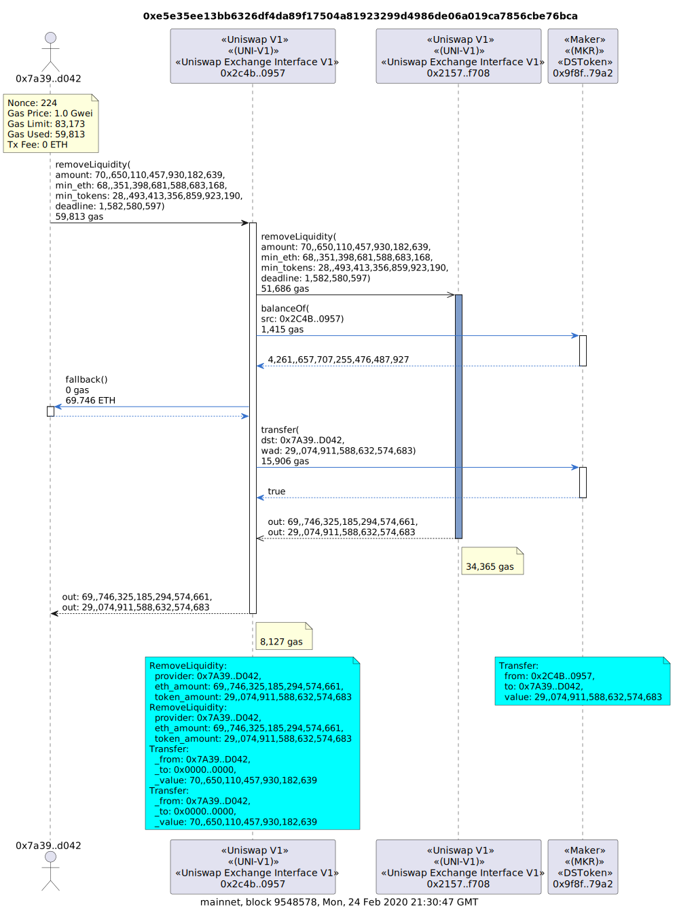
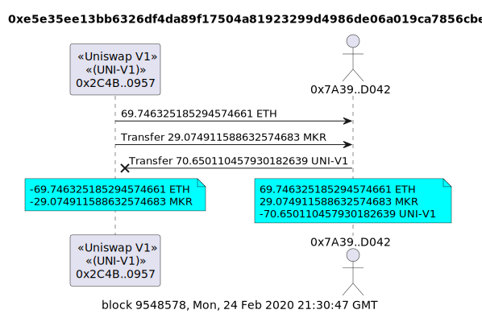

# UML for Ethereum Transactions

[](https://www.npmjs.com/package/tx2uml)
[](https://twitter.com/naddison)

[Unified Modeling Language (UML)](https://en.wikipedia.org/wiki/Unified_Modeling_Language) sequence diagram generator for Ethereum transaction.

The following _contract call_ and _value transfer_ diagrams are for the Uniswap V1 transaction [0xe5e35ee13bb6326df4da89f17504a81923299d4986de06a019ca7856cbe76bca](https://etherscan.io/tx/0xe5e35ee13bb6326df4da89f17504a81923299d4986de06a019ca7856cbe76bca) that removes MKR liquidity from the Uniswap V1 MKR pool.

### Contract Call Diagram



See a lot more call diagram examples with different options [here](./examples/README.md).

There's also call diagram examples in the [Evolution of Uniswap](./examples/uniswap/README.md) examples.

## Value Transfer Diagrams



More value transfer diagram examples can be found [here](./examples/transfers/README.md).

There's also value transfer diagram examples in the [Evolution of Uniswap](./examples/uniswap/README.md) examples.

# Install

The following installation assumes [Node.js](https://nodejs.org/en/download/) has already been installed which comes with [Node Package Manager (NPM)](https://www.npmjs.com/).

`tx2uml` needs [Java](https://www.java.com/en/download/) installed to generate the diagrams using [PlantUML](https://plantuml.com/).

To install globally so you can run `tx2uml` from anywhere

```bash
npm link tx2uml --only=production
```

To upgrade run

```bash
npm install tx2uml -g
```

# Usage

## Command Line Interface (CLI)

Use the `-h` option to see the `tx2uml` CLI usage options

```
Usage: tx2uml [command] <options>

Ethereum transaction visualizer that generates UML sequence diagrams from an Ethereum archive node and Etherscan like
block explorer

Options:
  -f, --outputFormat <value>    output file format (choices: "png", "svg", "eps", "puml", default: "svg")
  -o, --outputFileName <value>  output file name. Defaults to shortened tx hashes joined together with a 'v' prefix for value transfer diagrams.
  -u, --url <url>               URL of the archive node with trace transaction support (default: "http://localhost:8545", env: ARCHIVE_NODE_URL)
  -c, --chain <value>           blockchain explorer to get contract source code from. `none` will not get any source code. `custom` will use the `explorerUrl` option. (choices: "mainnet", "custom", "none", "goerli", "sepolia", "arbitrum", "optimisim", "polygon", "avalanche", "bsc", "crono", "fantom", "gnosis", "moonbeam", "celo", "base", default: "mainnet", env: ETH_NETWORK)
  -e, --explorerUrl <url>       required if a `custom` chain is used. eg a testnet like Polygon Mumbai https://api-testnet.polygonscan.com/api (env: EXPLORER_URL)
  -cf, --configFile <value>     name of the json configuration file that can override contract details like name and ABI (default: "tx.config.json")
  -af, --abiFile <value>        name of the json abi file that can override contract details like ABI (default: "tx.abi.json")
  -m, --memory <gigabytes>      max Java memory of PlantUML process in gigabytes. Java default is 1/4 of physical memory. Large txs in png format will need up to 12g. svg format is much better for large transactions.
  -hf, --hideFooter             Hides the boxes at the bottom of the contract lifelines. (default: false)
  -hc, --hideCaption            Hides the network, block number and timestamp at the bottom of the diagram. (default: false)
  -v, --verbose                 run with debugging statements (default: false)
  -V, --version                 output the version number
  -h, --help                    display help for command

Commands:
  call [options] <txHash(s)>    Generates a UML sequence diagram of transaction contract calls between contracts (default).
  value <txHash(s)>             Generates a UML sequence diagram of token and ether value transfers between accounts and contracts. This requires an archive node that supports debug_traceTransaction with custom EVM tracers which are Geth, Erigon or Anvil.
  copy [options] <txHash(s)>    Copies one or more transactions from one chain to another. This is either relayed with the original signature or impersonated with a different signer.
  help [command]                display help for command
```

### Call command

```
Usage: tx2uml call <txhash(s)> [options]

Generates a UML sequence diagram of transaction contract calls between contracts (default).

Arguments:
  txHash(s)                   transaction hash or an array of hashes in hexadecimal format with a 0x prefix. If running for multiple transactions, the comma-separated list of transaction hashes must not have white spaces

Options:
  -n, --nodeType <value>       type of Ethereum node the provider url is pointing to. This determines which trace API is used (choices: "geth", "erigon", "nether", "openeth", "tgeth", "besu", "anvil", "reth", default: "geth", env: ARCHIVE_NODE_TYPE)
  -k, --etherscanKey <value>   Etherscan like block explorer API key
  -a, --noAddresses <value>    hide calls to contracts in a list of comma-separated addresses with a 0x prefix
  -d, --depth <value>          limit the transaction call depth
  -e, --noEther                hide ether values (default: false)
  -g, --noGas                  hide gas usages (default: false)
  -l, --noLogDetails           hide log details emitted from contract events (default: false)
  -p, --noParams               hide function params and return values (default: false)
  -pv, --noParamValues         only hide function parameter values, not the names. Will display "?" if the name is not specified in the ABI (default: false)
  -t, --noTxDetails            hide transaction details like nonce, gas and tx fee (default: false)
  -x, --noDelegates            hide delegate calls from proxy contracts to their implementations and calls to deployed libraries (default: false)
  --mapSource <mapped-source>  Maps contracts to similar verified contracts on Etherscan. Useful for factory deployed contracts.
                               Left of the colon ":" is a comma-separated list of addresses that don't have verified source code.
                               In them middle is colon ":" that separates the two lists.
                               Right of the colon ":" is a comma-separated list of addresses that have verified source code.
                               For example: --mapSource 0x88e6a0c2ddd26feeb64f039a2c41296fcb3f5640:0x8f8EF111B67C04Eb1641f5ff19EE54Cda062f163
  -h, --help                   display help for command
```

### Value command

```
Usage: tx2uml value <txhash(s)> [options]

Generates a UML sequence diagram of token and ether value transfers between accounts and contracts. This requires an archive node that supports debug_traceTransaction with custom EVM tracers which are Geth, Erigon or Anvil.

Arguments:
  txHash(s)   transaction hash or an array of hashes in hexadecimal format with a 0x prefix. If running for multiple transactions, the comma-separated list of transaction hashes must not have white spaces

Options:
  -e, --onlyToken              get transfers only from token events. No ETH transfers will be included. Use when provider does not support debug_traceTransaction with custom tracer. (default: false)
  --mapSource <mapped-source>  Maps contracts to similar verified contracts on Etherscan. Useful for factory deployed contracts.
                               Left of the colon ":" is a comma-separated list of addresses that don't have verified source code.
                               In them middle is colon ":" that separates the two lists.
                               Right of the colon ":" is a comma-separated list of addresses that have verified source code.
                               For example: --mapSource 0x88e6a0c2ddd26feeb64f039a2c41296fcb3f5640:0x8f8EF111B67C04Eb1641f5ff19EE54Cda062f163
  -hb, --hideBalances          Hides the changes in ether and token balances at the bottom. (default: false)
  -h, --help                   display help for command
```

### Copy command

```
Usage: tx2uml copy <txhash(s)> [options]

Copies one or more transactions from one chain to another. This is either relayed with the original signature or
impersonated with a different signer.

Arguments:
  txHash(s)                    transaction hash or an array of hashes in hexadecimal format with a 0x prefix. If
                               running for multiple transactions, the comma-separated list of transaction hashes must
                               not have white spaces

Options:
  -du, --destUrl <url>         url of the node provider the transaction is being copied to (default:
                               "http://localhost:8545", env: DEST_NODE_URL)
  -i, --impersonate <address>  Address of the account that is to be impersonated. This only works for development nodes
                               like Hardhat and Anvil. The default is the transaction is relayed so is from the
                               original signer.
  -h, --help                   display help for command
```

## Configuration file

You can use a config file to set contract properties that are not available on chain or on Etherscan. For example, the contract's name and protocol.
The config file can also be used to supply contract ABIs if a contract has not been verified on Etherscan.
This is particularly useful if you are testing on a local fork of mainnet and some of the contracts in the transaction are yet to be deployed on mainnet.

The config file is in json format and has json schema [config.schema.json](./config.schema.json). The config file is an object with an address property for each contract.

The default file is `tx.config.json` in the current working folder, but you can set the location and name of the config file with the `-cf, --configFile <value>` option.

An example config file

```
{
  "0xd6ed651CfDf7778794649FfA87557EF091DfFE81": {
    "protocolName": "mStable",
    "contractName": "Convex3CrvVault",
    "tokenSymbol": "mv3CRV",
    "tokenName": "Convex 3Crv Vault",
    "abi": [
      ...
    ]
  },
  "0xaF94d5585CCCb04afcf98cA49E60F09f96f6444d": {
    "protocolName": "mStable",
    "contractName": "CurveMetapoolCalculatorLibrary"
  }
}
```

# Call Sequence Syntax


## Participants

The participant names are shortened contract addresses. Basically, the first and last 2 bytes in hexadecimal format with a 0x prefix.

Stereotypes are added for the contract and token name if they can be sourced. The contract name comes from Etherscan's verified contracts.

## Messages

There are five types of messages

-   **Call** is a solid or dotted line with a filled arrow head at the `to` contract.
-   **Return** is a dotted line with a filled arrow head at the `from` contract.
-   **Delegate** is a solid or dotted line with an open arrow head at the `to` contract.
-   **Create** is a filled line with a filled arrow head and a circle at the contract being created.
-   **Selfdestruct** is a solid line with a half filled arrow head looping back on itself with a `Self-Destruct` label.

Call and delegate messages with a dotted line are proxy calls that uses the calling contract's `fallback` function.

## Delegate Calls

A [delegatecall](https://github.com/ethereum/EIPs/issues/23) allows code to be executed on a contract in the context of the calling contract. That is, the delegated code appears as if it is running on the caller's contract. This means it has access to the caller's storage, Ether and calls will appear to come from the caller. Examples of delegate calls are proxy contracts calling their implementations or calls to library contracts.

In the sequence diagram, the lifeline of the delegated call will be in blue and calls will come from the calling contract. In the below example, the third call is the delegate call to the `0x3333..4444` contract. Although the code is executed on the `0x3333..4444` contract, the context is from `0x2222..3333` so the two calls to `0x4444..5555` are shown in blue and are from `0x2222..3333`.

The `-x` or `--noDelegates` option can be used to hide all delegate calls.


# Data Source

## Archive node that supports tracing transactions

`tx2uml` needs an Ethereum archive node that supports the
[debug_traceTransaction](https://geth.ethereum.org/docs/interacting-with-geth/rpc/ns-debug#debugtracetransaction) or
[trace_transaction](https://openethereum.github.io/JSONRPC-trace-module#trace_transaction) JSON RPC APIs.

The ethereum node url can be set with the `-u` or `--url` options or by exporting the `ARCHIVE_NODE_URL` environment variable.

Known Ethereum node clients that support `debug_traceTransaction` with a `tracer` parameter are:

-   [Go-Ethereum (Geth)](https://github.com/ethereum/go-ethereum)
-   [Erigon (fka Turbo-Geth)](https://github.com/ledgerwatch/erigon)

`tx2uml` will use `--nodeType geth` as it's default option.

You can test if your node supports `debug_traceTransaction` with the following `curl` command

```bash
curl --location --request POST 'https://your.node.url/yourApiKey' \
--header 'Content-Type: application/json' \
--data-raw '{
    "jsonrpc":"2.0",
    "method":"debug_traceTransaction",
    "params":["0xe5e35ee13bb6326df4da89f17504a81923299d4986de06a019ca7856cbe76bca", {"tracer": "callTracer"}],
    "id":1
}'
```

Anvil, Hardhat and Genache all support `debug_traceTransaction` but without the `tracer` parameter so will not work with tx2uml.

Known Ethereum node clients that support `trace_transaction` are:

-   [OpenEthereum](https://github.com/openethereum/openethereum)
-   [Nethermind](https://nethermind.io/client)
-   [Hyperledger Besu](https://www.hyperledger.org/use/besu)
-   [Anvil](https://github.com/foundry-rs/foundry/tree/master/anvil)

You can test if your node supports `trace_transaction` with the following `curl` command

```bash
curl --location --request POST 'https://your.node.url/yourApiKey' \
--header 'Content-Type: application/json' \
--data-raw '{
    "jsonrpc":"2.0",
    "method":"trace_transaction",
    "params":["0xb2b0e7b286e83255928f81713ff416e6b8d0854706366b6a9ace46a88095f024"],
    "id":1
}'
```

### Ethereum client trace support

|                                          | OpenEthereum | Nethereum | Besu | Geth | Erigon | rETH | Akula | Anvil | Hardhat | Ganache |
| ---------------------------------------- | ------------ | --------- | ---- | ---- | ------ | ---- | ----- | ----- | ------- | ------- |
| trace_replayTransaction                  | X            | X         |      |      | X      | X    | X     |       |         |         |
| trace_transaction                        | X            | X         | X    |      | X      | X    |       | X     |         |         |
| trace_rawTransaction                     | X            | X         | X    |      |        | X    | X     |       |         |         |
| debug_traceTransaction                   |              | X         | X    | X    | X      | X    |       | X     | X       | X       |
| debug_traceTransaction with tracer param |              |           |      | X    | X      |      |       |       |         |         |

### Ethereum API provider trace support

|                                      | Alchemy | QuickNode | Chainstack | GetBlock | WatchData | Infura |
| ------------------------------------ | ------- | --------- | ---------- | -------- | --------- | ------ |
| trace_transaction                    | X       | X         | X          | X        | X         |        |
| debug_traceTransaction               | X       | X         | X          |          |           |        |
| debug_traceTransaction call tracer   | X       | X         | X          |          |           |        |
| debug_traceTransaction custom tracer |         | X         | X          |          |           |        |

Most Ethereum API providers do not provide tracing or debugging APIs as they are resource intensive on the server side.

-   [Alchemy](https://alchemyapi.io/) supports both [trace_transaction](https://docs.alchemy.com/reference/trace-transaction) and [debug_traceTransaction](https://docs.alchemy.com/reference/sdk-tracetransaction) on their paid [Growth plan](https://alchemyapi.io/pricing). Only the in-built `call` and `prestate` tracers are supported. Custom tracers is not supported.

-   [QuickNode](https://www.quicknode.com/) supports both [trace_transaction](https://www.quicknode.com/docs/ethereum/trace_transaction) and [debug_traceTransaction](https://www.quicknode.com/docs/ethereum/debug_traceTransaction) on their paid plan. The in-built `call` and `prestate` tracers are supported. Custom tracers can be requested via support and approved if within resourcing limits.

-   [Chainstack](https://chainstack.com/) supports both [trace_transaction](https://docs.chainstack.com/api/ethereum/trace_transaction) and [debug_traceTransaction](https://docs.chainstack.com/api/ethereum/debug_traceTransaction) on their Growth plan when a dedicated Geth or Erigon archive node is deployed. For Erigon, this includes built-in and custom tracer support.

-   [GetBlock](https://getblock.io/) supports [trace_transaction](https://getblock.io/docs/available-nodes-methods/ETH/JSON-RPC/trace_transaction/) but not [debug_traceTransaction](https://getblock.io/docs/available-nodes-methods/ETH/JSON-RPC/debug_traceTransaction/).

-   [WatchData](https://www.watchdata.io/) supports [trace_transaction](https://docs.watchdata.io/powered-api/trace/trace_transaction) and is available on their free plan.

-   [Infura](https://infura.io/) does not support either `trace_transaction` or `debug_traceTransaction`.

## Etherscan

[Etherscan](https://etherscan.io/) is used to get the Application Binary Interfaces (ABIs) for the contracts used in a transaction. Etherscan's [get contract ABI](https://etherscan.io/apis#contracts) API is used with module `contract` and action `getsourcecode`. For example
https://api.etherscan.io/api?module=contract&action=getsourcecode&address=0xBB9bc244D798123fDe783fCc1C72d3Bb8C189413

# PlantUML

[PlantUML](https://plantuml.com/) is a Java program that can convert Plant UML syntax into png, svg or eps images. tx2uml pipes the PlantUML to the spawned Java process which then pipes the image outputs to a file.

[plantuml.jar version 1.2023.10](https://sourceforge.net/projects/plantuml/files/1.2023.10/plantuml-mit-1.2023.10.tar.gz/download) under [MIT license](https://en.wikipedia.org/wiki/MIT_License) is currently shipped in the [lib](./lib) folder.

See [Recent changes](https://plantuml.com/changes) for PlantUML's release notes.

## PlantText

[PlantText](https://www.planttext.com/) is an online tool that generates diagrams from PlantUML.

## PlantUML extension for VS Code

[Jebbs PlantUML](https://marketplace.visualstudio.com/items?itemName=jebbs.plantuml) extension for VS Code is used to authoring the PlantUML diagrams.

`Alt-D` on Windows, or `Option-D` on Mac, to stat PlantUML preview in VS Code.

## Generate png files form puml

The following will generate png files for the above examples.

```
java -jar ./lib/plantuml.jar ./examples/syntax.puml ./examples/delegate.puml
```

# UML Syntax

Good online resources for learning UML

-   [PlantUML Sequence diagrams](https://plantuml.com/sequence-diagram)
-   [Ashley's PlantUML Doc](https://plantuml-documentation.readthedocs.io/en/latest/diagrams/sequence.html)
-   [UML 2 Sequence Diagramming Guidelines](http://www.agilemodeling.com/style/sequenceDiagram.htm)

# Similar Visualisation Tools

-   [Transaction Tracer](https://openchain.xyz/trace)
-   [Tenderly](https://dashboard.tenderly.co/)
-   [EthTx info](http://ethtx.info/)
-   [Bloxy](https://bloxy.info/)
-   [Etherscan](https://etherscan.io/txs)

## Development

### Testing

If you want to run all the tests, you'll need to export the following environment variables which are used by the tests to connect to different archive nodes.
If you are using [Archive Node](https://archivenode.io/), you need to replace <your api key> with the API key provided to you.

```
export ARCHIVE_NODE_URL=https://api.archivenode.io/<your api key>/nethermind
export NETHERMIND_URL=https://api.archivenode.io/<your api key>/nethermind
export ERIGON_GETH_URL=https://api.archivenode.io/<your api key>/erigon
npm run test
```

Note two of the tests are currently failing due to bugs TurboGeth and Nethermind bugs.

### Etherscan Labels

The contract labels are sourced from @brianleect Brian Lee Cheow Teng's [etherscan-labels](https://github.com/brianleect/etherscan-labels) repository.

Save the following

-   [data/etherscan/combined/combinedAllLabels.json ](https://github.com/brianleect/etherscan-labels/blob/main/data/etherscan/combined/combinedAllLabels.json) to [lib/labels/mainnet.json](./lib/labels/mainnet.json)
-   [data/arbiscan/combined/combinedAllLabels.json](https://github.com/brianleect/etherscan-labels/blob/main/data/arbiscan/combined/combinedAllLabels.json) to [lib/labels/arbitrum.json](./lib/labels/arbitrum.json)
-   [data/polygonscan/combined/combinedAllLabels.json](https://github.com/brianleect/etherscan-labels/blob/main/data/polygonscan/combined/combinedAllLabels.json) to [lib/labels/polygon.json](./lib/labels/polygon.json)
-   [data/avalanche/combined/combinedAllLabels.json](https://github.com/brianleect/etherscan-labels/blob/main/data/avalanche/combined/combinedAllLabels.json) to [lib/labels/avalanche.json](./lib/labels/avalanche.json)
-   [data/bscscan/combined/combinedAllLabels.json](https://github.com/brianleect/etherscan-labels/blob/main/data/bscscan/combined/combinedAllLabels.json) to [lib/labels/bsc.json](./lib/labels/bsc.json)
-   [data/ftmscan/combined/combinedAllLabels.json](https://github.com/brianleect/etherscan-labels/blob/main/data/ftmscan/combined/combinedAllLabels.json) to [lib/labels/fantom.json](./lib/labels/fantom.json)
-   [data/optimism/combined/combinedAllLabels.json](https://github.com/brianleect/etherscan-labels/blob/main/data/optimism/combined/combinedAllLabels.json) to [lib/labels/optimism.json](./lib/labels/optimism.json)

### Publishing

npm build and publish commands

```bash
npm run prettier:fix
npm run clean
npm run package-lock
npm run build
npm run permit
# make tx2uml globally available for local testing
npm link
# check all the files are included in the npm package
npm pack --dry-run
npm publish
```
