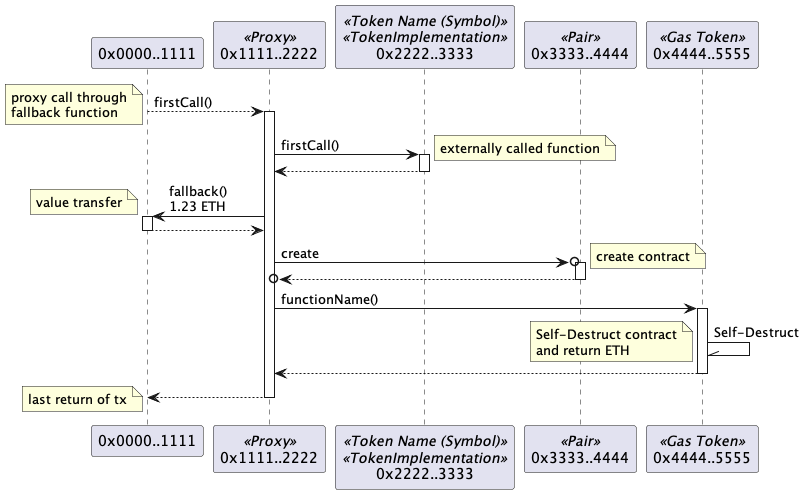

# Ethereum transaction to UML sequence diagram generator

[](https://badge.fury.io/js/tx2uml)

[Unified Modeling Language (UML)](https://en.wikipedia.org/wiki/Unified_Modeling_Language) sequence diagram generator for Ethereum transaction.

The below example transaction is a [mStable](https://mstable.org/) swap from 5,100 USD Coin (USDC) to 5,096 Tether USD (USDT).

```
tx2uml 0xb2b0e7b286e83255928f81713ff416e6b8d0854706366b6a9ace46a88095f024
```


See a lot more examples [here](./examples/README.md)

# Install

The following installation assumes [Node.js](https://nodejs.org/en/download/) has already been installed which comes with [Node Package Manager (NPM)](https://www.npmjs.com/).

`tx2uml` needs [Java](https://www.java.com/en/download/) installed as that's required by [PlantUML](https://plantuml.com/) to generate the diagrams.

To install globally so you can run `tx2uml` from anywhere

```bash
npm link tx2uml --only=production
```

To upgrade run

```bash
npm install tx2uml -g
```

To see which version you are using

```bash
npm ls tx2uml
```

# Usage

## Command Line Interface (CLI)

Use the `-h` option to see the `tx2uml` CLI usage options

```
$ tx2uml -h
Usage: tx2uml <transaction hash or comma separated list of hashes> [options]

Ethereum transaction visualizer that generates a UML sequence diagram of transaction contract calls from an Ethereum archive node and Etherscan API.

The transaction hashes have to be in hexadecimal format with a 0x prefix. If running for multiple transactions, the comma separated list of transaction hashes must not have white spaces. eg spaces or tags.

Options:
  -f, --outputFormat <value>    output file format: png, svg or puml (default: "png")
  -o, --outputFileName <value>  output file name. Defaults to the transaction hash.
  -u, --url <url>               URL of the archive node with trace transaction support. Can also be set with the ARCHIVE_NODE_ENV environment variable. (default: http://localhost:8545)
  -n, --nodeType <value>        geth (GoEthereum), tgeth (Turbo-Geth), openeth (OpenEthereum, previously Parity), nether (Nethermind), besu (Hyperledger Besu). Can also be set with the ARCHIVE_NODE_TYPE env var. (default: "geth")
  -p, --noParams                Hide function params and return values (default: false)
  -g, --noGas                   Hide gas usages (default: false)
  -e, --noEther                 Hide ether values (default: false)
  -t, --noTxDetails             Hide transaction details like nonce, gas and tx fee (default: false)
  -v, --verbose                 run with debugging statements (default: false)
  -h, --help                    output usage information

```

# Syntax



## Participants

The participant names are shortened contract addresses. Basically, the first and last 2 bytes in hexadecimal format with a 0x prefix.

Stereotypes are added for the contract and token name if they can be sourced. The contract name comes from Etherscan's verified contracts. The token name comes from Alethio.

## Messages

There are five types of messages

-   **Call** is a solid or dotted line with a filled arrow head at the `to` contract.
-   **Return** is a dotted line with a filled arrow head at the `from` contract.
-   **Delegate** is a solid or dotted line with an open arrow head at the `to` contract.
-   **Create** is a filled line with a filled arrow head and a circle at the contract being created.
-   **Selfdestruct** is a solid line with a half filled arrow head looping back on itself with a `Self-Destruct` label.

Call and delegate messages with a dotted line are proxy calls that uses the calling contract's `fallback` function.

## Delegate Calls

A [delegatecall](https://github.com/ethereum/EIPs/issues/23) allows code to be executed on a contract in the context of the calling contract. That is, the delegated code appears as if it is running on the caller's contract. This means it has access to the caller's storage, Ether and calls will appear to come from the caller.

In the sequence diagram, the lifeline of the delegated call will be in blue and calls will come from the calling contract. In the below example, the third call is the delegate call to the `0x3333..4444` contract. Although the code is executed on the `0x3333..4444` contract, the context is from `0x2222..3333` so the two calls to `0x4444..5555` are shown in blue and are from `0x2222..3333`.


# Data Source

## Archive node that supports tracing transactions

`tx2uml` needs an Ethereum archive node that supports the [debug_traceTransaction](https://geth.ethereum.org/docs/rpc/ns-debug#debug_tracetransaction) or [trace_replayTransaction](https://openethereum.github.io/JSONRPC-trace-module#trace_replaytransaction) JSON RPC APIs.

Known Ethereum node clients that support `debug_traceTransaction` are:
* [Go-Ethereum (Geth)](https://github.com/ethereum/go-ethereum)
* [Turbo-Geth](https://github.com/ledgerwatch/turbo-geth)

`tx2uml` will use `--nodeType geth` as it's default option.

You can test if your node supports `debug_traceTransaction` with the following `curl` command

```bash
curl --location --request POST 'https://your.node.url/yourApiKey' \
--header 'Content-Type: application/json' \
--data-raw '{
    "jsonrpc":"2.0",
    "method":"debug_traceTransaction",
    "params":["0xe5e35ee13bb6326df4da89f17504a81923299d4986de06a019ca7856cbe76bca", {"tracer": "callTracer"}],
    "id":1
}'
```

Known Ethereum node clients that support `trace_replayTransaction` are:
* [OpenEthereum](https://github.com/openethereum/openethereum)
* [Nethermind](https://nethermind.io/client)
* [Hyperledger Besu](https://www.hyperledger.org/use/besu) supports tracing with method is [trace_transaction](https://besu.hyperledger.org/en/stable/Reference/API-Methods/#trace_transaction) which has the same response.

You can test if your node supports `trace_replayTransaction` with the following `curl` command

```bash
curl --location --request POST 'https://your.node.url/yourApiKey' \
--header 'Content-Type: application/json' \
--data-raw '{
    "jsonrpc":"2.0",
    "method":"trace_replayTransaction",
    "params":["0xb2b0e7b286e83255928f81713ff416e6b8d0854706366b6a9ace46a88095f024", ["trace"]],
    "id":1
}'
```

### Ethereum API providers

Most Ethereum API providers do not provide tracing or debugging APIs as they are resource intensive on the server side.

* [ArchiveNode.io](https://archivenode.io/) brings archive data on the Ethereum blockchain to small time developers who otherwise couldn't afford it. They offer both Nethermind and Turbo-Geth archive nodes. If you want to use one specifically, you can add either /nethermind or /turbogeth to the end of your endpoint.

[Infura](https://infura.io/) does not support tracing or debugging transactions.

[Alchemy](https://alchemyapi.io/) does support tracing transactions on their paid [Growth plan](https://alchemyapi.io/pricing) but it was not reliable at the time of development.

## Etherscan

[Etherscan](https://etherscan.io/) is used to get the Application Binary Interfaces (ABIs) for the contracts used in a transaction. Etherscan's [get contract ABI](https://etherscan.io/apis#contracts) API is used with module `contract` and action `getsourcecode`. For example
https://api.etherscan.io/api?module=contract&action=getsourcecode&address=0xBB9bc244D798123fDe783fCc1C72d3Bb8C189413

# PlantUML

[PlantUML](https://plantuml.com/) is a Java program that can convert Plant UML syntax into png, svg or eps images. tx2uml pipes the PlantUML to the spawned Java process which then pipes the image outputs to a file.

[plantuml.jar version 1.2020.26](http://sourceforge.net/projects/plantuml/files/plantuml.1.2020.26.jar/download) is currently shipped in the [lib](./lib) folder.

See [Recent changes](https://plantuml.com/changes) for PlantUML's release notes.

## PlantText

[PlantText](https://www.planttext.com/) is an online tool that generates diagrams from PlantUML.

## PlantUML extension for VS Code

[Jebbs PlantUML](https://marketplace.visualstudio.com/items?itemName=jebbs.plantuml) extension for VS Code is used to authoring the PlantUML diagrams.

`Alt-D` on Windows, or `Option-D` on Mac, to stat PlantUML preview in VS Code.

## Generate png files form puml

The following will generate png files for the above examples.

```
java -jar ./lib/plantuml.jar ./examples/syntax.puml ./examples/delegate.puml 
```

# UML Syntax

Good online resources for learning UML

-   [PlantUML Sequence diagrams](https://plantuml.com/sequence-diagram)
-   [Ashley's PlantUML Doc](https://plantuml-documentation.readthedocs.io/en/latest/diagrams/sequence.html)
-   [UML 2 Sequence Diagramming Guidelines](http://www.agilemodeling.com/style/sequenceDiagram.htm)

# Similar transaction visualisation tools

-   [Parity Trace Decoder](https://github.com/k06a/parity-trace-decoder)
-   [Tenderly](https://dashboard.tenderly.dev/)
-   [EthTx info](http://ethtx.info/)
-   [Bloxy](https://bloxy.info/)
-   [Etherscan](https://etherscan.io/txs)
-   [tokenflow](https://tokenflow.xyz/)

## Development

npm test, build and publish commands

```bash
npm run test
npm run prettier:fix
npm run clean
npm run build
# make tx2uml globally available for local testing
npm link
# check all the files are included in the npm package
npm pack --dry-run
npm publish
```
