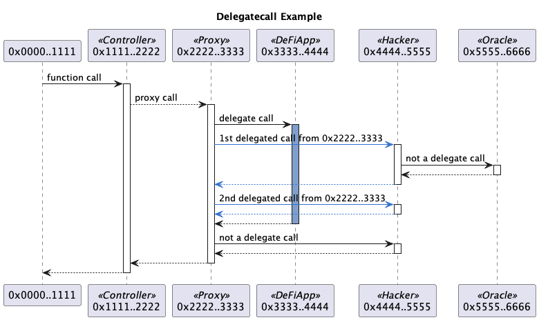

# Ethereum transaction to UML sequence diagram generator

[](https://badge.fury.io/js/tx2uml)

[Unified Modeling Language (UML)](https://en.wikipedia.org/wiki/Unified_Modeling_Language) sequence diagram generator for Ethereum transaction.


See a lot more examples with different options [here](./examples/README.md)

# Install

The following installation assumes [Node.js](https://nodejs.org/en/download/) has already been installed which comes with [Node Package Manager (NPM)](https://www.npmjs.com/).

`tx2uml` needs [Java](https://www.java.com/en/download/) installed as that's required by [PlantUML](https://plantuml.com/) to generate the diagrams.

To install globally so you can run `tx2uml` from anywhere

```bash
npm link tx2uml --only=production
```

To upgrade run

```bash
npm install tx2uml -g
```

To see which version you are using

```bash
npm ls tx2uml
```

# Usage

## Command Line Interface (CLI)

Use the `-h` option to see the `tx2uml` CLI usage options

```
$ tx2uml -hUsage: tx2uml [command] <options>

Ethereum transaction visualizer that generates UML sequence diagrams from an Ethereum archive node and Etherscan like block explorer.

Options:
  -f, --outputFormat <value>    output file format. (choices: "svg", "png", "eps", "puml", default: "svg")
  -o, --outputFileName <value>  output file name. Defaults to the transaction hash.
  -u, --url <url>               URL of the archive node with trace transaction support. (default: "http://localhost:8545", env: ARCHIVE_NODE_URL)
  -n, --nodeType <value>        geth (GoEthereum), anvil, tgeth (Erigion, fka Turbo-Geth), openeth (OpenEthereum, fka Parity), nether (Nethermind), besu (Hyperledger Besu). (choices: "geth", "anvil", "tgeth", "openeth", "nether", "besu", default: "geth", env:
                                ARCHIVE_NODE_TYPE)
  -k, --etherscanKey <value>    Etherscan API key. Register your API key at https://etherscan.io/myapikey
  -c, --chain <value>           Blockchain explorer network to get source code from. (choices: "mainnet", "polygon", "bsc", "arbitrum", "ropsten", "kovan", "rinkeby", "goerli", "sepolia", default: "mainnet", env: ETH_NETWORK)
  -cf, --configFile <value>     Name of the json configuration file that can override contract details like name and ABI. (default: "tx.config.json")
  -v, --verbose                 run with debugging statements. (default: false)
  -V, --version                 output the version number
  -h, --help                    display help for command

Commands:
  call [options] <txHash(s)>    UML sequence diagram of transaction contract calls. (default)
  value <txHash(s)>             UML sequence diagram of token and ether value transfers.
  help [command]                display help for command
```

### Call command

```
Usage: tx2uml call <txhash(s)> [options]

UML sequence diagram of transaction contract calls. (default)

Arguments:
  txHash(s)                  Transaction hash or an array of hashes in hexadecimal format with a 0x prefix. If running for multiple transactions, the comma separated list of transaction hashes must not have white spaces.

Options:
  -a, --noAddresses <value>  Hide calls to contracts in a list of comma separated addresses with a 0x prefix.
  -d, --depth <value>        Limit the transaction call depth.
  -e, --noEther              Hide ether values. (default: false)
  -g, --noGas                Hide gas usages. (default: false)
  -l, --noLogDetails         Hide log details emitted from contract events. (default: false)
  -p, --noParams             Hide function params and return values. (default: false)
  -t, --noTxDetails          Hide transaction details like nonce, gas and tx fee. (default: false)
  -x, --noDelegates          Hide delegate calls from proxy contracts to their implementations and calls to deployed libraries. (default: false)
  -h, --help                 display help for command

```

### Value command

```
Usage: tx2uml call <txhash(s)> [options]

UML sequence diagram of transaction contract calls. (default)

Arguments:
  txHash(s)                  Transaction hash or an array of hashes in hexadecimal format with a 0x prefix. If running for multiple transactions, the comma separated list of transaction hashes must not have white spaces.

Options:
  -a, --noAddresses <value>  Hide calls to contracts in a list of comma separated addresses with a 0x prefix.
  -d, --depth <value>        Limit the transaction call depth.
  -e, --noEther              Hide ether values. (default: false)
  -g, --noGas                Hide gas usages. (default: false)
  -l, --noLogDetails         Hide log details emitted from contract events. (default: false)
  -p, --noParams             Hide function params and return values. (default: false)
  -t, --noTxDetails          Hide transaction details like nonce, gas and tx fee. (default: false)
  -x, --noDelegates          Hide delegate calls from proxy contracts to their implementations and calls to deployed libraries. (default: false)
  -h, --help                 display help for command
workspaces/tx2uml % npx tx2uml value --help
Usage: tx2uml value <txhash(s)> [options]

UML sequence diagram of token and ether value transfers.

Arguments:
  txHash(s)   Transaction hash or an array of hashes in hexadecimal format with a 0x prefix. If running for multiple transactions, the comma separated list of transaction hashes must not have white spaces.

Options:
  -h, --help  display help for command
```

## Configuration file

You can use a config file to set contract properties that are not available on chain or on Etherscan. For example, the contract's name and protocol.
The config file can also be used to supply contract ABIs if a contract has not been verified on Etherscan.
This is particularly useful if you are testing on a local fork of mainnet and some of the contracts in the transaction are yet to be deployed on mainnet.

The config file is in json format and has json schema [config.schema.json](./config.schema.json). The config file is an object with an address property for each contract.

The default file is `tx.config.json` in the current working folder, but you can set the location and name of the config file with the `-cf, --configFile <value>` option.

An example config file

```
{
  "0xd6ed651CfDf7778794649FfA87557EF091DfFE81": {
    "protocolName": "mStable",
    "contractName": "Convex3CrvVault",
    "tokenSymbol": "mv3CRV",
    "tokenName": "Convex 3Crv Vault",
    "abi": [
      ...
    ]
  },
  "0xaF94d5585CCCb04afcf98cA49E60F09f96f6444d": {
    "protocolName": "mStable",
    "contractName": "CurveMetapoolCalculatorLibrary"
  }
}
```

# Syntax


## Participants

The participant names are shortened contract addresses. Basically, the first and last 2 bytes in hexadecimal format with a 0x prefix.

Stereotypes are added for the contract and token name if they can be sourced. The contract name comes from Etherscan's verified contracts. The token name comes from Alethio.

## Messages

There are five types of messages

-   **Call** is a solid or dotted line with a filled arrow head at the `to` contract.
-   **Return** is a dotted line with a filled arrow head at the `from` contract.
-   **Delegate** is a solid or dotted line with an open arrow head at the `to` contract.
-   **Create** is a filled line with a filled arrow head and a circle at the contract being created.
-   **Selfdestruct** is a solid line with a half filled arrow head looping back on itself with a `Self-Destruct` label.

Call and delegate messages with a dotted line are proxy calls that uses the calling contract's `fallback` function.

## Delegate Calls

A [delegatecall](https://github.com/ethereum/EIPs/issues/23) allows code to be executed on a contract in the context of the calling contract. That is, the delegated code appears as if it is running on the caller's contract. This means it has access to the caller's storage, Ether and calls will appear to come from the caller. Examples of delegate calls are proxy contracts calling their implementations or calls to library contracts.

In the sequence diagram, the lifeline of the delegated call will be in blue and calls will come from the calling contract. In the below example, the third call is the delegate call to the `0x3333..4444` contract. Although the code is executed on the `0x3333..4444` contract, the context is from `0x2222..3333` so the two calls to `0x4444..5555` are shown in blue and are from `0x2222..3333`.

The `-x` or `--noDelegates` option can be used to hide all delegate calls.



# Data Source

## Archive node that supports tracing transactions

`tx2uml` needs an Ethereum archive node that supports the [debug_traceTransaction](https://geth.ethereum.org/docs/rpc/ns-debug#debug_tracetransaction) or [trace_transaction](https://openethereum.github.io/JSONRPC-trace-module#trace_transaction) JSON RPC APIs.

The ethereum node url can be set with the `-u` or `--url` options or by exporting the `ARCHIVE_NODE_URL` environment variable. For example

```bash
export ARCHIVE_NODE_URL=https://api.archivenode.io/<your API key>/turbogeth 
```

Known Ethereum node clients that support `debug_traceTransaction` are:

-   [Go-Ethereum (Geth)](https://github.com/ethereum/go-ethereum)
-   [Erigon (fka Turbo-Geth)](https://github.com/ledgerwatch/erigon)

`tx2uml` will use `--nodeType geth` as it's default option.

You can test if your node supports `debug_traceTransaction` with the following `curl` command

```bash
curl --location --request POST 'https://your.node.url/yourApiKey' \
--header 'Content-Type: application/json' \
--data-raw '{
    "jsonrpc":"2.0",
    "method":"debug_traceTransaction",
    "params":["0xe5e35ee13bb6326df4da89f17504a81923299d4986de06a019ca7856cbe76bca", {"tracer": "callTracer"}],
    "id":1
}'
```

Known Ethereum node clients that support `trace_transaction` are:

- [OpenEthereum](https://github.com/openethereum/openethereum)
- [Nethermind](https://nethermind.io/client)
- [Hyperledger Besu](https://www.hyperledger.org/use/besu)
- [Anvil](https://github.com/foundry-rs/foundry/tree/master/anvil)

You can test if your node supports `trace_transaction` with the following `curl` command

```bash
curl --location --request POST 'https://your.node.url/yourApiKey' \
--header 'Content-Type: application/json' \
--data-raw '{
    "jsonrpc":"2.0",
    "method":"trace_transaction",
    "params":["0xb2b0e7b286e83255928f81713ff416e6b8d0854706366b6a9ace46a88095f024"],
    "id":1
}'
```

### Node trace transaction support

|  | OpenEthereum | Nethereum | Besu | Geth | Erigon | Akula | Anvil | Hardhat | Ganache |
|---|---|---|---|---|---|---|---|---|---|
| trace_replayTransaction | X | X | | | | X | | | |
| trace_transaction | X | X | X | | | | X | | |
| trace_rawTransaction | X | X | X | | | X | | | |
| debug_traceTransaction | | | | X | X | | | X | X |
| debug_traceTransaction with tracer param | | | | X | X | | | | |

### Ethereum API providers

Most Ethereum API providers do not provide tracing or debugging APIs on their free plans as they are resource intensive on the server side.

As of Aug 2022, [WatchData](https://www.watchdata.io/) is the only provider that offers tracing on a free plan.
[ArchiveNode.io](https://archivenode.io/) also supports tracing and is free but it is only available to approved DeFi developers.

- [ArchiveNode.io](https://archivenode.io/) offer both Nethermind and Erigon (fka Turbo-Geth) archive nodes. If you want to use one specifically, you can add either /nethermind or /turbogeth to the end of your endpoint.

- [WatchData](https://www.watchdata.io/) supports [trace_transaction](https://docs.watchdata.io/powered-api/trace/trace_transaction) and is available on their free plan.

- [Alchemy](https://alchemyapi.io/) supports [trace_transaction](https://docs.alchemy.com/reference/trace-transaction) on their paid [Growth plan](https://alchemyapi.io/pricing).

- [QuickNode](https://www.quicknode.com/) supports both [trace_transaction](https://www.quicknode.com/docs/ethereum/trace_transaction) and [debug_traceTransaction](https://www.quicknode.com/docs/ethereum/debug_traceTransaction) on their paid plan.

- [Chainstack](https://chainstack.com/) supports both `trace_transaction` and `debug_traceTransaction` but only on their expensive Business plan.

- [GetBlock](https://getblock.io/) supports [trace_transaction](https://getblock.io/docs/available-nodes-methods/ETH/JSON-RPC/trace_transaction/) but it just hangs when tested. It also supports [debug_traceTransaction](https://getblock.io/docs/available-nodes-methods/ETH/JSON-RPC/debug_traceTransaction/) but not with the tracer option required by tx2uml.

- [Moralis](https://moralis.io/) supports both `trace_transaction` and `debug_traceTransaction` on their paid plan.

- [Infura](https://infura.io/) does not support tracing or debugging transactions.

## Etherscan

[Etherscan](https://etherscan.io/) is used to get the Application Binary Interfaces (ABIs) for the contracts used in a transaction. Etherscan's [get contract ABI](https://etherscan.io/apis#contracts) API is used with module `contract` and action `getsourcecode`. For example
https://api.etherscan.io/api?module=contract&action=getsourcecode&address=0xBB9bc244D798123fDe783fCc1C72d3Bb8C189413

# PlantUML

[PlantUML](https://plantuml.com/) is a Java program that can convert Plant UML syntax into png, svg or eps images. tx2uml pipes the PlantUML to the spawned Java process which then pipes the image outputs to a file.

[plantuml.jar version 1.2023.1](http://sourceforge.net/projects/plantuml/files/plantuml-jar-mit-1.2023.1.zip/download) under [MIT license](https://en.wikipedia.org/wiki/MIT_License) is currently shipped in the [lib](./lib) folder.

See [Recent changes](https://plantuml.com/changes) for PlantUML's release notes.

## PlantText

[PlantText](https://www.planttext.com/) is an online tool that generates diagrams from PlantUML.

## PlantUML extension for VS Code

[Jebbs PlantUML](https://marketplace.visualstudio.com/items?itemName=jebbs.plantuml) extension for VS Code is used to authoring the PlantUML diagrams.

`Alt-D` on Windows, or `Option-D` on Mac, to stat PlantUML preview in VS Code.

## Generate png files form puml

The following will generate png files for the above examples.

```
java -jar ./lib/plantuml.jar ./examples/syntax.puml ./examples/delegate.puml
```

# UML Syntax

Good online resources for learning UML

-   [PlantUML Sequence diagrams](https://plantuml.com/sequence-diagram)
-   [Ashley's PlantUML Doc](https://plantuml-documentation.readthedocs.io/en/latest/diagrams/sequence.html)
-   [UML 2 Sequence Diagramming Guidelines](http://www.agilemodeling.com/style/sequenceDiagram.htm)

# Similar transaction visualisation tools

-   [Parity Trace Decoder](https://github.com/k06a/parity-trace-decoder)
-   [Tenderly](https://dashboard.tenderly.dev/)
-   [EthTx info](http://ethtx.info/)
-   [Bloxy](https://bloxy.info/)
-   [Etherscan](https://etherscan.io/txs)
-   [tokenflow](https://tokenflow.xyz/)

## Development

### Testing

If you want to run all the tests, you'll need to export the following environment variables which are used by the tests to connect to different archive nodes.
If you are using [Archive Node](https://archivenode.io/), you need to replace <your api key> with the API key provided to you.

```
export ARCHIVE_NODE_URL=https://api.archivenode.io/<your api key>/nethermind
export NETHERMIND_URL=https://api.archivenode.io/<your api key>/nethermind
export TURBO_GETH_URL=https://api.archivenode.io/<your api key>/turbogeth
npm run test
```

Note two of the tests are currently failing due to bugs TurboGeth and Nethermind bugs.

### Publishing

npm build and publish commands

```bash
npm run prettier:fix
npm run clean
npm run build
# make tx2uml globally available for local testing
npm link
# check all the files are included in the npm package
npm pack --dry-run
npm publish
```
