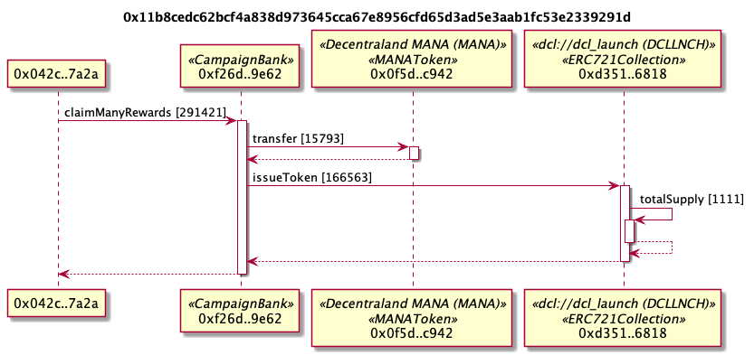
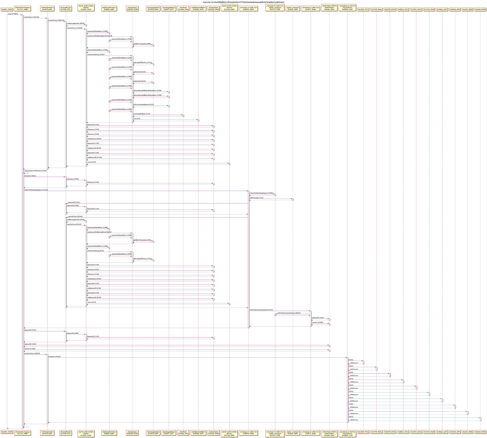

# Example UML Sequence Diagrams

## Uniswap

This is example is removing liquidity from the Uniswap MKR pool. The 69.75 ETH is a value transfer, not a contract call.


```
tx2uml 0xe5e35ee13bb6326df4da89f17504a81923299d4986de06a019ca7856cbe76bca -o uniswapMKRRemove.png
```

## Decentraland



```
tx2uml 0x11b8cedc62bcf4a838d973645cca67e8956cfd65d3ad5e3aab1fc53e2339291d
```

## Unknown function names

When the ABI and function signatures are not known, the function selector is show. That's 0xae8123ba in the below example


```
tx2uml 0x7aca0414c3c04e58c11ad6b7d13bbfe1c6d4500fbe402900da9abf6bb6f53a8d
```

## Failed transactions

See which contract call failed a transaction. The error message will also be shown in a note if a reason string was passed to the require or revert.


```
tx2uml 0x0a99314379caf3dcbbc6e1f5b0dda8a41e3a8b5a0d9b1c1ec744be1f1cf781ea
```

## Kyber

[Kyber network](https://kyber.network/) transaction.


```
tx2uml 0xe2e3ef2513c8e3da306cb427c03ae0114062fd09568bec559d5880c490ff743a
```

## 1inch Exchange

The [1inch exchange](https://1inch.exchange/) aggregates the exchange of Ether and tokens across on-chain liquidity providers so does lots of calls to different contracts.



```
tx2uml 0x34e4f8b86b5c3fe5a9e30e7cf75b242ed3e6e4eeea68cfaf3ca68ef1edb93ed1 -o 1inch
```
