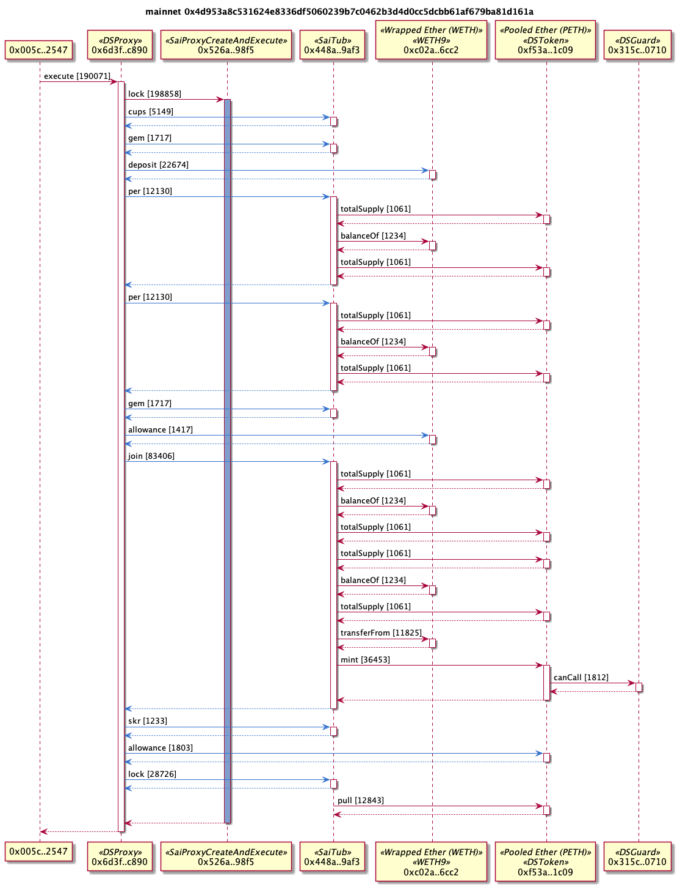
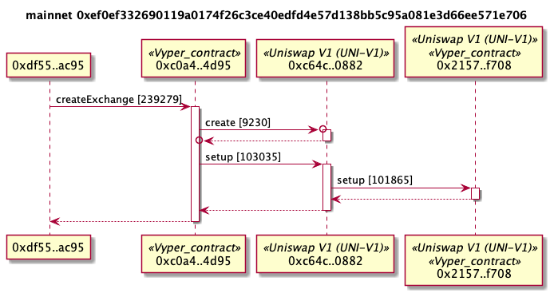
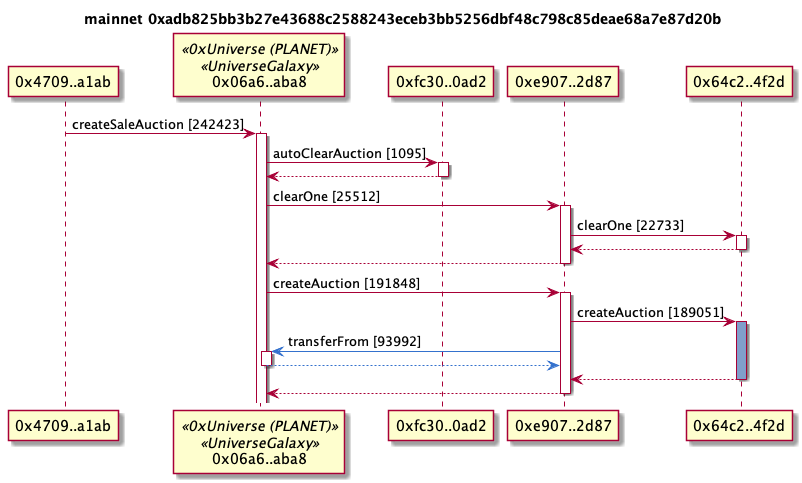

# Example UML Sequence Diagrams

## Maker DAO

Locking more ETH in a CDP

```
tx2uml 0x4d953a8c531624e8336df5060239b7c0462b3d4d0cc5dcbb61af679ba81d161a -g -o makerDao
```



## Delegate calls

A [delegatecall](https://github.com/ethereum/EIPs/issues/23) allows code to be executed on a contract in the context of the calling contract. That is, the delegated code appears as if it is running on the caller's contract. This means it has access to the caller's storage, Ether and calls will appear to come from the caller.

In the sequence diagram, the lifeline of the delegated call will be in blue and calls will come from the calling contract. In the below example, the third call is the delegate call to the `0x3333..4444` contract. Although the code is executed on the `0x3333..4444` contract, the context is from `0x2222..3333` so the two calls to `0x4444..5555` are shown in blue and are from `0x2222..3333`.


## Uniswap with delegatecall

This is example is removing liquidity from the [Uniswap](https://uniswap.exchange/) MKR pool. The 69.75 ETH is a value transfer, not a contract call.
This transaction is also a little tricky in the second `removeLiquidity` call is a `delegatecall`. The subsequent `balanceOf`, ETH transfer and `transfer` calls in blue are executed by the third contract but made to appear to be executed from the second contract. The ETH transfer is from the second contract even though the third contract executed the code. Execution that has been delegated is marked with a blue lifeline.

```
tx2uml 0xe5e35ee13bb6326df4da89f17504a81923299d4986de06a019ca7856cbe76bca -o uniswapMKRRemove
```


## Uniswap with create contract

This [Uniswap](https://uniswap.exchange/) transaction creates a new market by creating a new exchange contract. The contract create message is the second message with the circle at the end of the array.

```
0xef0ef332690119a0174f26c3ce40edfd4e57d138bb5c95a081e3d66ee571e706 -g -o ./examples/uniswapFactory
```



## 0xUniverse with delegated message

Creating a sale auction on [0xUniverse](https://0xuniverse.com/). The last `transferFrom` message in blue is executed on the `0x64c2..4f2d` contract marked in blue, but the message context is from `0xe907..2d87`.

```
tx2uml 0xadb825bb3b27e43688c2588243eceb3bb5256dbf48c798c85deae68a7e87d20b -g -o 0xUniverse
```



## Unknown function names

When the ABI and function signatures are not known, the function selector is show. That's 0xae8123ba in the below example

```
tx2uml 0x7aca0414c3c04e58c11ad6b7d13bbfe1c6d4500fbe402900da9abf6bb6f53a8d -o funcSelectors
```


## Failed transactions

See which contract call failed a transaction. The error message will also be shown in a note if a reason string was passed to the require or revert.

```
tx2uml 0x0a99314379caf3dcbbc6e1f5b0dda8a41e3a8b5a0d9b1c1ec744be1f1cf781ea -o failedTx
```


## Kyber

[Kyber network](https://kyber.network/) transaction.

```
tx2uml 0xe2e3ef2513c8e3da306cb427c03ae0114062fd09568bec559d5880c490ff743a -o kyber
```


## 1inch Exchange

The [1inch exchange](https://1inch.exchange/) aggregates the exchange of Ether and tokens across on-chain liquidity providers so does lots of calls to different contracts.

```
tx2uml 0x34e4f8b86b5c3fe5a9e30e7cf75b242ed3e6e4eeea68cfaf3ca68ef1edb93ed1 -o 1inchSynth
```


## Synthetix

Burn SNX tokens on [Synthetix Mintr](https://www.synthetix.io/products/mintr).

```
t2uml 0x72536f7869cf075ea63174bdcf962bb0409cd4218798ed7194d95a0bae776180 -g -0 ./synthExchange
```


## Aave Flash Loan

An [Aave](https://aave.com/) flash loan for 5,555 DAI

```
tx2uml 0xa87905dacd83c7ffaba0828ae52ecc1723c036432e97ee6e0af6e528e039ba3a -g -o aaveFlashLoan
```


## Decentraland

Claiming rewards on [Decentraland](https://decentraland.org/)

```
tx2uml 0x11b8cedc62bcf4a838d973645cca67e8956cfd65d3ad5e3aab1fc53e2339291d -o decentraland
```


