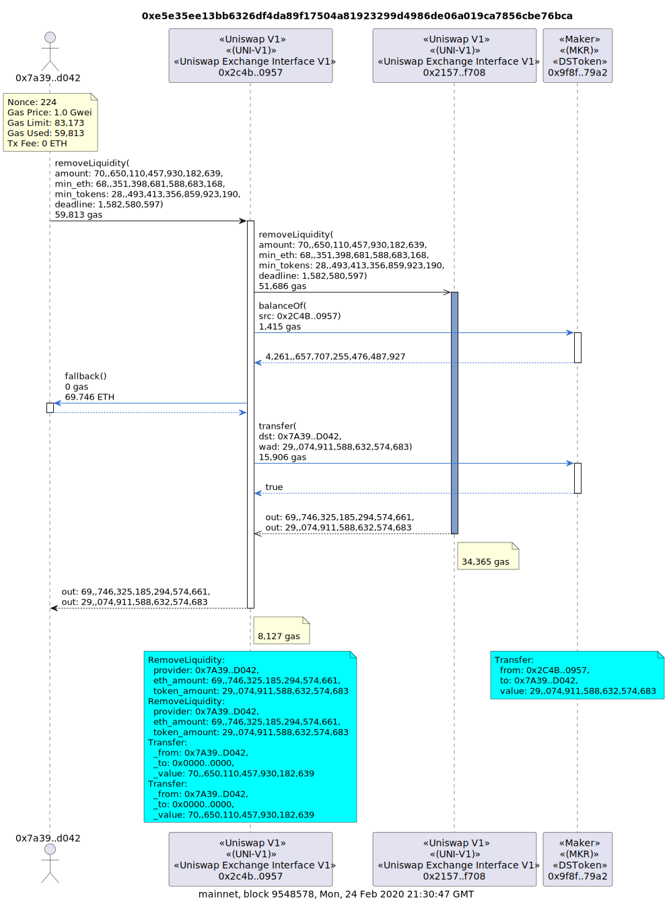
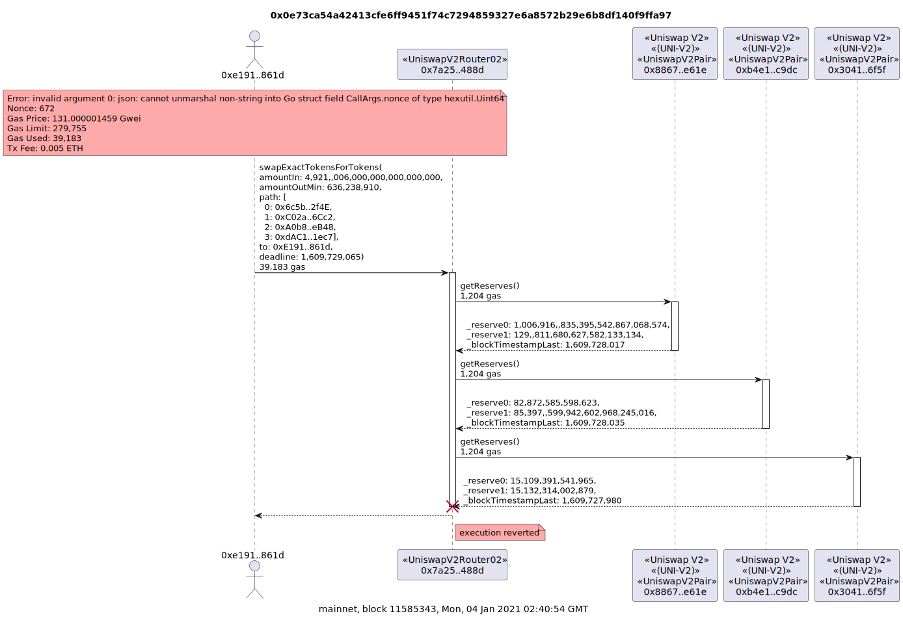
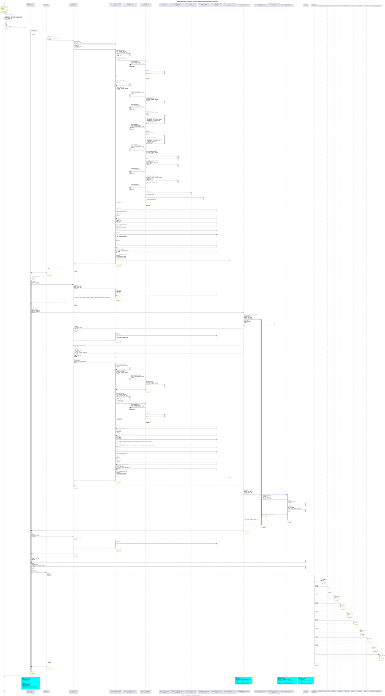

# Example Contract Call Diagrams

The below examples assume the `ARCHIVE_NODE_URL` environment variable has been set. For example

```
export ARCHIVE_NODE_URL=https://yournode/apikey
```

Alternatively, the `-u, --url <url>` option can be used to set the url of your archive node. eg

```
tx2uml 0xe5e35ee13bb6326df4da89f17504a81923299d4986de06a019ca7856cbe76bca --url https://yournode/apikey
```

The `-v, --verbose` option will show the debug statements while `tx2uml` is running.

## Uniswap V2 Swap

[Uniswap](https://uniswap.exchange/) token swap of 500 Tether USD (USDT) for 0.64 Wrapped Ether (WETH) and then 0.64 WETH for 291 Shipping.io (SPI).

```
tx2uml 0x1fa132b63521e60f4debcfe2180aa90c771b803b7470c0db4c7913bcf207449b
```


## Uniswap V1 Remove Liquidity with a delegatecall

This example is removing liquidity from the [Uniswap V1](https://uniswap.exchange/) MKR pool. The 69.75 ETH is a value transfer, not a contract call.
This transaction is also a little tricky in the second `removeLiquidity` call is a `delegatecall`. The subsequent `balanceOf`, ETH transfer and `transfer` calls in blue are executed by the third contract but made to appear to be executed from the second contract. The ETH transfer is from the second contract even though the third contract executed the code. Execution that has been delegated is marked with a blue lifeline.

The two commas in the `amount` value 70,,650,110,457,930,182,639 marks the 18th decimal place which is used to convert wei to Ether and many token values.

```
tx2uml 0xe5e35ee13bb6326df4da89f17504a81923299d4986de06a019ca7856cbe76bca
```



## Uniswap V1 Factory

This [Uniswap V1](https://uniswap.exchange/) transaction creates a new market by creating a new exchange contract. The contract create message is the second message with the circle at the end of the array.

If the contract has not been verified on Etherscan, the constructor params will be `?` as tx2uml will not know what the constructor params were.

```
tx2uml 0xef0ef332690119a0174f26c3ce40edfd4e57d138bb5c95a081e3d66ee571e706
```


## Deploy STRAX contract

The constructor parameters will be parsed if the contract has been verified on Etherscan.

```
tx2uml 0x22bd02c8d934627a4b79e7fd66dba69492ddf1bbb7a86dd74fdaf7bb32f8ea24
```


## Unknown function names

When the ABI and function signatures are not known, the function selector is show. That is the `0xae8123ba` in the below example

```
tx2uml 0x7aca0414c3c04e58c11ad6b7d13bbfe1c6d4500fbe402900da9abf6bb6f53a8d
```


## Failed Uniswap V2 transactions

See which contract call failed a transaction. The error message will also be shown in a note if a reason string was passed to the require or revert.

```
tx2uml 0x0e73ca54a42413cfe6ff9451f74c7294859327e6a8572b29e6b8df140f9ffa97
```



## Aragon MultiSig Wallet with Ether Values

Transaction confirmation of the [Aragon MultiSig Wallet](https://etherscan.io/address/0xcafe1a77e84698c83ca8931f54a755176ef75f2c) which shows the transfer of 10,000 Ether in the fallback calls.

```
tx2uml 0x44e34b97bccd7406f199ec18e61489baa6619e4093269e1df559735dd31b25bf
```


## Multi transactions

Multiple transactions can be included in a contract call diagram by passing a comma-separated list of transaction hashes without any white spaces.

Here's an example of a WETH deposit and withdraw.

```
tx2uml 0x883e76ca9590e6cf37138548f04b5c3317e0e8d62c44665d2083cbee70152bd1,0x13142a10fe690b3e4c10708a68037e795fb85e048d70ccf15c639efb339e2e43
```


## Crypto Kitties

[Crypto Kitties](https://www.cryptokitties.co/)

```
tx2uml 0x89a683d5eb5c894d2725a05b3a880aa228c9d2ef72d9cdbfe4bac5b8077db6c1
```


## Moloch DAO

A rage quit from the [Moloch DAO](https://molochdao.com/) with the `--noParams` option. `-p` could also be used.

```
tx2uml 0x1744b7b718fe5cd553fa0b83b10df26f5fe249c7f8dccd3c23aa97030e1df70e --noParams -o molochRageQuit
```


## 1inch Exchange

A [1inch exchange](https://1inch.exchange/) swap where the 4th message call failed but was caught by the calling contract so the transaction could continue.

There are also examples Delf-Destruct messages at the end of the transaction with the [Chi Gas Token](https://1inch-exchange.medium.com/1inch-introduces-chi-gastoken-d0bd5bb0f92b).

```
tx2uml 0x34e4f8b86b5c3fe5a9e30e7cf75b242ed3e6e4eeea68cfaf3ca68ef1edb93ed1 -o 1inchFailedInternal
```



## Aave Flash Loan

An [Aave](https://aave.com/) flash loan for 5,555 DAI with `--noParams` and `--noGas` options. The shorter `-p` and `-g` options could also be used for the same thing.

```
tx2uml 0xa87905dacd83c7ffaba0828ae52ecc1723c036432e97ee6e0af6e528e039ba3a --noParams --noGas -o aaveFlashLoan
```


## mStable Swap

[mStable](https://mstable.org/) swap of 180,000 USD Coin (USDC) for 179,959 Tether USD (USDT) with the delegate calls hidden with the `--noDelegates` option.

```
tx2uml 0x7210c306842d275044789b02ae64aff4513ed812682de7b1cbeb12a4a0dd07af --noDelegates --noLogDetails --noGas -o ./musd-v3-swap-noproxy
```


The below example is the same swap with the delegate calls.
The second call is from the [mUSD proxy contract](https://etherscan.io/address/0xe2f2a5c287993345a840db3b0845fbc70f5935a5#code) to the [mUSD logic implementation](https://etherscan.io/address/0x15b2838cd28cc353afbe59385db3f366d8945aee#code).
The third call is a call the [Manager library contract](https://etherscan.io/address/0x1e91f826fa8aa4fa4d3f595898af3a64dd188848#code).
The reason the function call is not resolved is the Solidity compiler does not include public and external functions in library Application Binary Interfaces (ABIs).
This means tx2uml can't match the function selector `0x4e3d3913` to the library's `computeSwap` function.

You can also see the delegate calls from USDC's proxy has been removed.

```
tx2uml 0x7210c306842d275044789b02ae64aff4513ed812682de7b1cbeb12a4a0dd07af --noLogDetails --noGas -o ./musd-v3-swap
```


## Vyper Contract Names

If the verified Vyper code on Etherscan contains the `@title` Natspec, that will be used as the contract name. If no `@title`, the contract name will be `Vyper_contract` which is what Etherscan defaults the name to.

The below example is claiming CRV tokens from a Curve Gauge. The second, third and forth contract all get their names from the `@title` Natspec in the verified code on Etherscan.

```
tx2uml 0x9e93a3ef8dbfd18f14253da66ef2451abe94330ecd98e1399245eb01751e5626 -v -o ./curve-minter-mint
```


## Maker DAO

The below example is of a [Maker DAO](https://makerdao.com/) Collateralized Debt Position (CDP) transaction. The `--noTxDetails` or `-t` option will not display the transaction details in a yellow note at the start of the first contract's lifeline.

```
tx2uml 0x4d953a8c531624e8336df5060239b7c0462b3d4d0cc5dcbb61af679ba81d161a --noTxDetails -f png
```


## Balancer Swap

[Balancer](https://balancer.finance/) swap of 1,153 USD Coin (USD) for 4,000 Frontier (Front)

The first `multihopBatchSwapExactOut` call is a good example of how multi dimensional parameters are displayed. The `swapSequences` is a two dimensional array of `Swap` structures which contains different properties of different types.

For larger transactions like this, svg is a better output than the png file format. Use the `--outputFormat` or `-f` options to specify the `png`, `svg` or `puml` formats.
The `--outputFileName` or `-o` option will specify the file to write the output to.
In the below example, the output file will be `balancerSwap.svg` in the folder `tx2uml` was run from.

```
tx2uml 0xe624e1e21e22fd312936a97df0852f4289ca88ab8bfdb40b679d46b55c842605 -f svg -o balancerSwap
```


