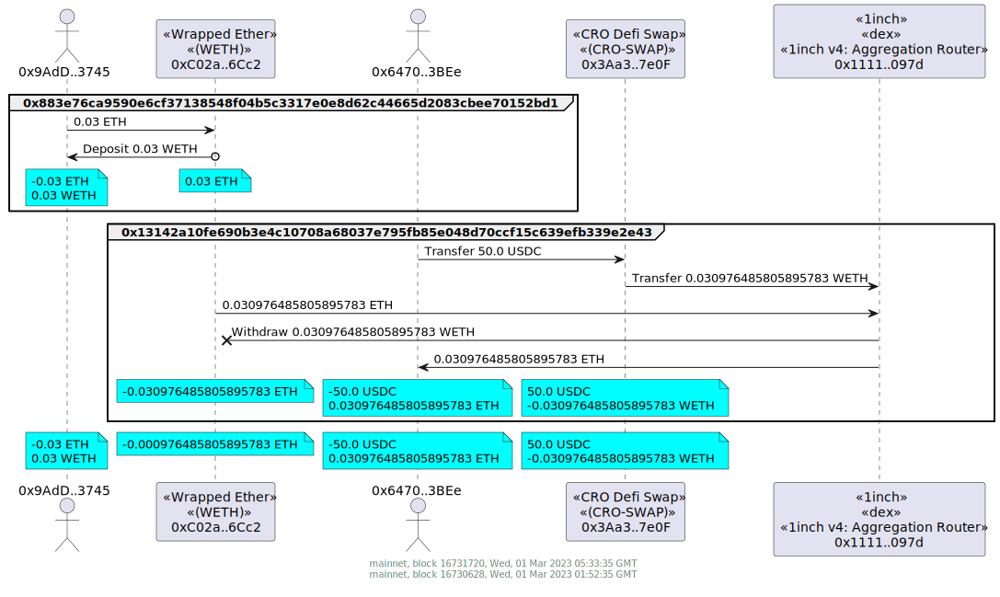

# Example Value Transfer Diagrams

The below examples assume the `ARCHIVE_NODE_URL` environment variable has been set. For example

```
export ARCHIVE_NODE_URL=https://yournode/apikey
```

Alternatively, the `-u, --url <url>` option can be used to set the url of your archive node. eg

```
tx2uml value 0xe5e35ee13bb6326df4da89f17504a81923299d4986de06a019ca7856cbe76bca --url https://yournode/apikey
```

The `-v, --verbose` option will show the debug statements while `tx2uml` is running.

## Uniswap V3 Swap

An example Uniswap V3 swap of ether (ETH) for XFT in tx
[0xafc8b33fd096bffaaec0c75f4fad0fc8815bc906761a44a8db72d8aea3c9fec6](https://etherscan.io/tx/0xafc8b33fd096bffaaec0c75f4fad0fc8815bc906761a44a8db72d8aea3c9fec6).

```
tx2uml value 0xafc8b33fd096bffaaec0c75f4fad0fc8815bc906761a44a8db72d8aea3c9fec6 -o ./uniswapV3swap
```


## WETH Deposit and Withdraw

Multiple transactions can be displayed in the same value transfer diagram by using a comma-separated list of transaction hashes without whitespaces.

In this example, a [WETH](https://etherscan.io/token/0xc02aaa39b223fe8d0a0e5c4f27ead9083c756cc2#code) deposit [0x883e76ca9590e6cf37138548f04b5c3317e0e8d62c44665d2083cbee70152bd1](https://etherscan.io/tx/0x883e76ca9590e6cf37138548f04b5c3317e0e8d62c44665d2083cbee70152bd1)
and withdraw [0x13142a10fe690b3e4c10708a68037e795fb85e048d70ccf15c639efb339e2e43](https://etherscan.io/tx/0x13142a10fe690b3e4c10708a68037e795fb85e048d70ccf15c639efb339e2e43)

```
tx2uml value 0x883e76ca9590e6cf37138548f04b5c3317e0e8d62c44665d2083cbee70152bd1,0x13142a10fe690b3e4c10708a68037e795fb85e048d70ccf15c639efb339e2e43 -o ./wethDepositWithddraw
```



## NFT Transfers

The following example is the purchase of three [Chungo](https://opensea.io/collection/chungos) NFTs using the [Blur](https://blur.io/) NFT marketplace.

```
tx2uml value 0x720e126ea17f4e0b2fcf021e6c6b90b55c5283527cdf50d4c2eb3cdbc012dbfc -o ./blurChungo
```


## Tokenized Vaults 

A deposit of USDC into mStable's USDC 3Pool Convex Meta Vault with transaction
[0xc717e875d1a3e9b59e721537287f5aba6542c12604f65f0a1026f55644d191a4](https://etherscan.io/tx/0xc717e875d1a3e9b59e721537287f5aba6542c12604f65f0a1026f55644d191a4)

```
tx2uml value 0xc717e875d1a3e9b59e721537287f5aba6542c12604f65f0a1026f55644d191a4 -o ./metavaultUsdcDeposit
```


