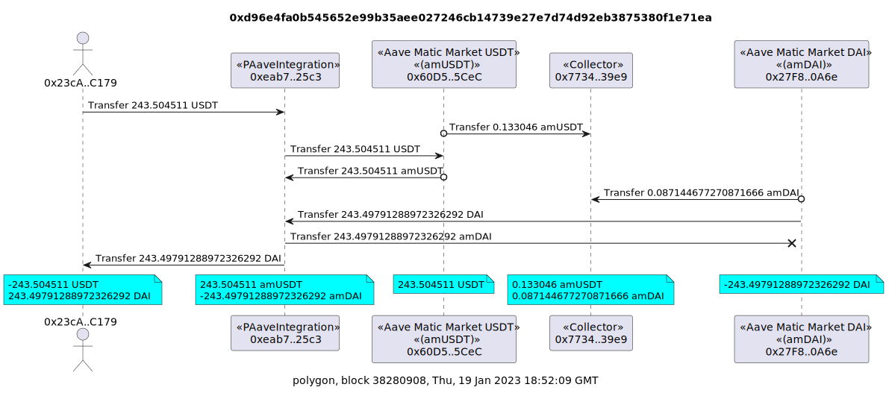

# Example Value Transfer Diagrams

The below examples assume the `ARCHIVE_NODE_URL` environment variable has been set. For example

```
export ARCHIVE_NODE_URL=https://yournode/apikey
```

Alternatively, the `-u, --url <url>` option can be used to set the url of your archive node. eg

```
tx2uml value 0xe5e35ee13bb6326df4da89f17504a81923299d4986de06a019ca7856cbe76bca --url https://yournode/apikey
```

The `-v, --verbose` option will show the debug statements while `tx2uml` is running.

## Uniswap V3 Swap

An example Uniswap V3 swap of ether (ETH) for XFT in tx
[0xafc8b33fd096bffaaec0c75f4fad0fc8815bc906761a44a8db72d8aea3c9fec6](https://etherscan.io/tx/0xafc8b33fd096bffaaec0c75f4fad0fc8815bc906761a44a8db72d8aea3c9fec6).

```
tx2uml value 0xafc8b33fd096bffaaec0c75f4fad0fc8815bc906761a44a8db72d8aea3c9fec6 -o ./uniswapV3swap
```


## WETH Deposit and Withdraw

Multiple transactions can be displayed in the same value transfer diagram by using a comma-separated list of transaction hashes without whitespaces.

In this example, a [WETH](https://etherscan.io/token/0xc02aaa39b223fe8d0a0e5c4f27ead9083c756cc2#code) deposit [0x883e76ca9590e6cf37138548f04b5c3317e0e8d62c44665d2083cbee70152bd1](https://etherscan.io/tx/0x883e76ca9590e6cf37138548f04b5c3317e0e8d62c44665d2083cbee70152bd1)
and withdraw [0x13142a10fe690b3e4c10708a68037e795fb85e048d70ccf15c639efb339e2e43](https://etherscan.io/tx/0x13142a10fe690b3e4c10708a68037e795fb85e048d70ccf15c639efb339e2e43)

```
tx2uml value 0x883e76ca9590e6cf37138548f04b5c3317e0e8d62c44665d2083cbee70152bd1,0x13142a10fe690b3e4c10708a68037e795fb85e048d70ccf15c639efb339e2e43 -o ./wethDepositWithddraw
```


## NFT Transfers

The following example is the purchase of three [Chungo](https://opensea.io/collection/chungos) NFTs using the [Blur](https://blur.io/) NFT marketplace.

```
tx2uml value 0x720e126ea17f4e0b2fcf021e6c6b90b55c5283527cdf50d4c2eb3cdbc012dbfc -o ./blurChungo
```


## Multi-Token Transfers (ERC-1155)

Transfers of token id 3 (eyes) of the [Zerion Genesis Collection](https://etherscan.io/nft/0x74ee68a33f6c9f113e22b3b77418b75f85d07d22/3).
ERC-1155 emits `TransferSingle` events.

```
tx2uml value 0x3cf8fd116d366bcf3e3fc7e8e03e87a22fb644fef31594811dfe9e6b10b5dbf8 --onlyToken -o ./transfer-single-zerion
```


## Mints

Below is a deposit of 70k USDC into mStable's USDC Meta Vault with transaction
[0xc717e875d1a3e9b59e721537287f5aba6542c12604f65f0a1026f55644d191a4](https://etherscan.io/tx/0xc717e875d1a3e9b59e721537287f5aba6542c12604f65f0a1026f55644d191a4).
Note the third, fifth and sixth transfers have a circle at the source.
This indicates it was a mint so the net positions at the end are not reduced.

```
tx2uml value 0xc717e875d1a3e9b59e721537287f5aba6542c12604f65f0a1026f55644d191a4 -o ./metavaultUsdcDeposit
```


## Burns

The below settle transaction run against mStable's 3CRV Meta Vault deposits 3CRV in the underlying mUSD, FRAX and BUSD Vaults which in turn add liquidity to their corresponding Curve Metapools and deposit the Curve Metapool LP token into Convex with tx
[0x142536caeb5e6cd552ed6885a5efe2a44756a403140f5e8d84b60532ec05f4f8](https://etherscan.io/tx/0x142536caeb5e6cd552ed6885a5efe2a44756a403140f5e8d84b60532ec05f4f8).
The first transfer is a burn of vcx3CRV-mUSD vault shares which is indicated with an `x` at the destination of the transfer.

```
tx2uml value 0x142536caeb5e6cd552ed6885a5efe2a44756a403140f5e8d84b60532ec05f4f8 -o ./metavaultSettle
```


## Polygon Only Token Transfers

If there is no access to a node provider that supports `debug_traceTransaction` with a custom EVM tracer, you can generate a value transfer diagram just from the token events.
Use the `-e --onlyToken` option to just get the token events. This means no ETH transfers in the transaction will be included which are sourced from calling `debug_traceTransaction`.

The following example is a mStable mUSD swap transaction on Polygon [0xd96e4fa0b545652e99b35aee027246cb14739e27e7d74d92eb3875380f1e71ea](https://polygonscan.com/tx/0xd96e4fa0b545652e99b35aee027246cb14739e27e7d74d92eb3875380f1e71ea).

The `-c, --chain` option is used so the contract ABIs are retrieved from [Polygonscan](https://polygonscan.com/) and the Polygon token details contract is used.

```
tx2uml value 0xd96e4fa0b545652e99b35aee027246cb14739e27e7d74d92eb3875380f1e71ea --onlyToken --chain polygon -o ./polygon-musd-swap
```


