# The Evolution of Uniswap

The following assumes the `ARCHIVE_NODE_URL` environment variable has been set to the URL of a provider node that supports custom EVM tracers.

## Uniswap V1

### Swap 22 USDC for ETH

[0x519acb59e0986ce142abbcec412617378499227f83e6149c2dd4aa445dda6117](https://etherscan.io/tx/0x519acb59e0986ce142abbcec412617378499227f83e6149c2dd4aa445dda6117)


```
tx2uml value -v 0x519acb59e0986ce142abbcec412617378499227f83e6149c2dd4aa445dda6117
```


```
tx2uml -v --noTxDetails --noGas --noParamValues --noDelegates 0x519acb59e0986ce142abbcec412617378499227f83e6149c2dd4aa445dda6117
```

### Swap 0.1 ETH for USDC

[0x59bd1333b443de0c3f138f5051963a9831ce3605544b27e88b2bd341d6bf7b5e](https://etherscan.io/tx/0x59bd1333b443de0c3f138f5051963a9831ce3605544b27e88b2bd341d6bf7b5e)


```
tx2uml value -v 0x59bd1333b443de0c3f138f5051963a9831ce3605544b27e88b2bd341d6bf7b5e
```


```
tx2uml -v --noTxDetails --noGas --noParamValues --noDelegates 0x59bd1333b443de0c3f138f5051963a9831ce3605544b27e88b2bd341d6bf7b5e
```

### Swap 1 USDC for Matic

[0x5f99937fc8bcb99c1362d01006e6c48402c885b2e23830a8bb53242d394b2290](https://etherscan.io/tx/0x5f99937fc8bcb99c1362d01006e6c48402c885b2e23830a8bb53242d394b2290)


```
tx2uml value -v 0x5f99937fc8bcb99c1362d01006e6c48402c885b2e23830a8bb53242d394b2290
```

The call diagram without proxy delegate calls

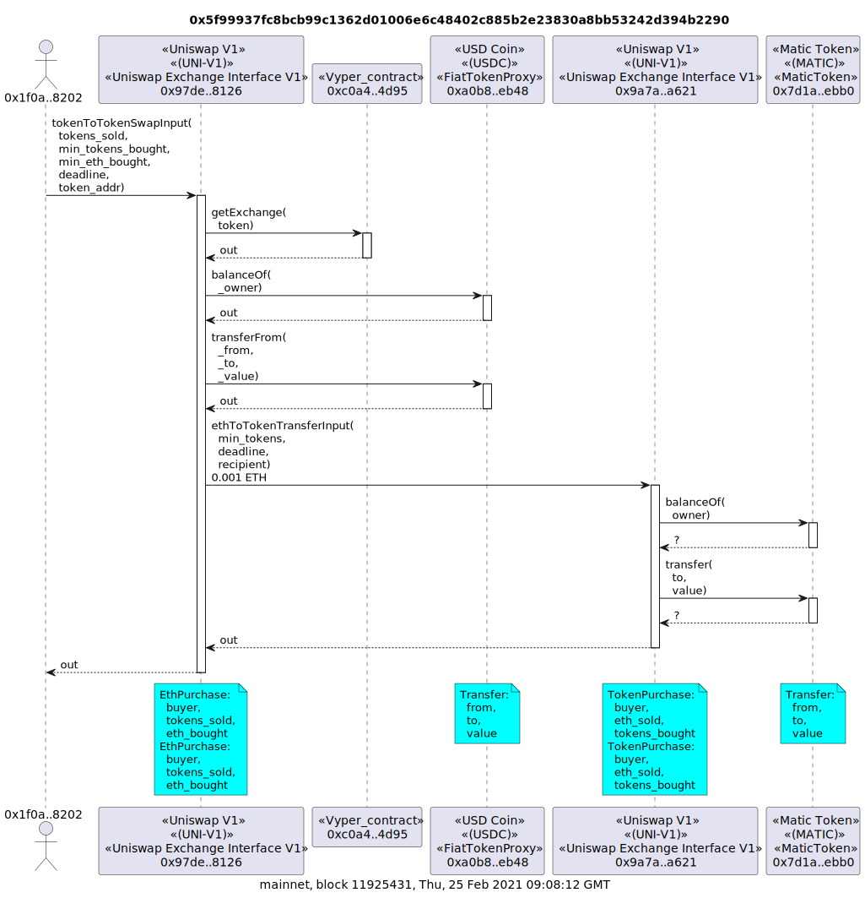

```
tx2uml -v --noTxDetails --noGas --noParamValues --noDelegates 0x5f99937fc8bcb99c1362d01006e6c48402c885b2e23830a8bb53242d394b2290 --outputFileName d5f992290.svg
```

The full call diagram with proxy delegate calls is [5f992290.svg](./5f992290.svg)

```
tx2uml -v 0x5f99937fc8bcb99c1362d01006e6c48402c885b2e23830a8bb53242d394b2290
```

## Uniswap V2

### Swap 911 USDC for ETH

[0x6b3339f2576fb1eb158c58545917b7c699187d0979a814e530199b50d4a2b9e4](https://etherscan.io/tx/0x6b3339f2576fb1eb158c58545917b7c699187d0979a814e530199b50d4a2b9e4)


```
tx2uml value -v 0x6b3339f2576fb1eb158c58545917b7c699187d0979a814e530199b50d4a2b9e4
```


```
tx2uml -v --noTxDetails --noGas --noParamValues --noDelegates 0x6b3339f2576fb1eb158c58545917b7c699187d0979a814e530199b50d4a2b9e4
```

### Swap 57 ETH for USDC

[0x7025eeb06aab8614b02fff39f3cc10db439fbb4b525c9d2d87dbd19bf17c7cac](https://etherscan.io/tx/0x7025eeb06aab8614b02fff39f3cc10db439fbb4b525c9d2d87dbd19bf17c7cac)


```
tx2uml value -v 0x7025eeb06aab8614b02fff39f3cc10db439fbb4b525c9d2d87dbd19bf17c7cac
```


```
tx2uml -v --noTxDetails --noGas --noParamValues --noDelegates 0x7025eeb06aab8614b02fff39f3cc10db439fbb4b525c9d2d87dbd19bf17c7cac
```

### Swap 900 DERC > USDC > WETH > ETH

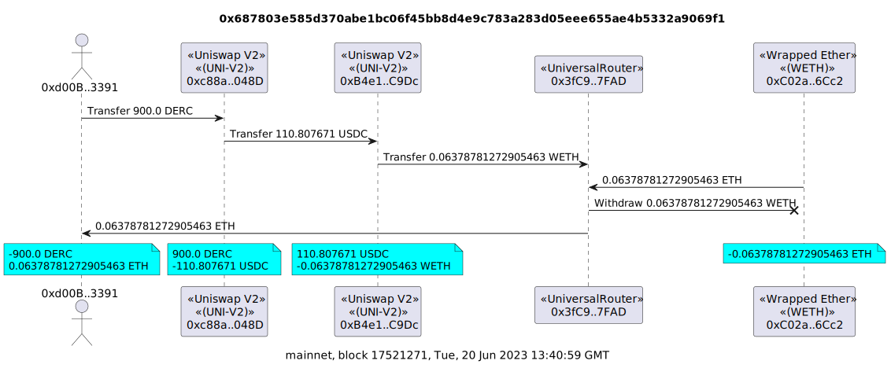

```
tx2uml value -v 0x687803e585d370abe1bc06f45bb8d4e9c783a283d05eee655ae4b5332a9069f1
```

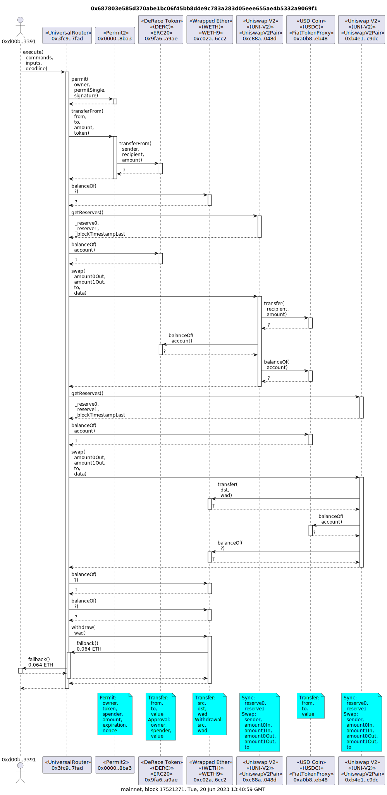

```
tx2uml -v --noTxDetails --noGas --noParamValues --noDelegates --noAddresses 0x0000000000000000000000000000000000000001 0x687803e585d370abe1bc06f45bb8d4e9c783a283d05eee655ae4b5332a9069f1 --outputFileName p687869f1
```

The full call diagram with proxy delegate calls is [687869f1.svg](./687869f1.svg)

```
tx2uml -v --noAddresses 0x0000000000000000000000000000000000000001 0x687803e585d370abe1bc06f45bb8d4e9c783a283d05eee655ae4b5332a9069f1
```

## Uniswap V3

### Swap 55 USDC for ETH

[0xc4eaff5ab7bacc93c76433753517c831fe0ff10182da4fc086cdf49ec7ec15b9](https://etherscan.io/tx/0xc4eaff5ab7bacc93c76433753517c831fe0ff10182da4fc086cdf49ec7ec15b9)


```
tx2uml value -v --mapSource 0x88e6a0c2ddd26feeb64f039a2c41296fcb3f5640:0x8f8EF111B67C04Eb1641f5ff19EE54Cda062f163 0xc4eaff5ab7bacc93c76433753517c831fe0ff10182da4fc086cdf49ec7ec15b9
```

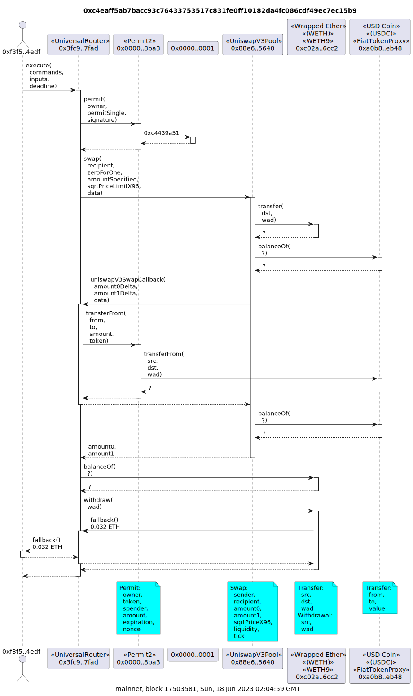

```
tx2uml -v --noTxDetails --noGas --noParamValues --noDelegates --mapSource 0x88e6a0c2ddd26feeb64f039a2c41296fcb3f5640:0x8f8EF111B67C04Eb1641f5ff19EE54Cda062f163 0xc4eaff5ab7bacc93c76433753517c831fe0ff10182da4fc086cdf49ec7ec15b9 --outputFileName pc4ea15b9
```

The full call diagram with proxy delegate calls is [c4ea15b9.svg](./c4ea15b9.svg)

```
tx2uml -v --noAddresses 0x0000000000000000000000000000000000000001 --mapSource 0x88e6a0c2ddd26feeb64f039a2c41296fcb3f5640:0x8f8EF111B67C04Eb1641f5ff19EE54Cda062f163 0xc4eaff5ab7bacc93c76433753517c831fe0ff10182da4fc086cdf49ec7ec15b9
```

### Swap 47 ETH for USDC

[0x3f019f050e79b3c7fbb5caf67fb3c842cad53e1c993f084836ae60215e3e3370](https://etherscan.io/tx/0x3f019f050e79b3c7fbb5caf67fb3c842cad53e1c993f084836ae60215e3e3370)


```
tx2uml value -v --mapSource 0x88e6a0c2ddd26feeb64f039a2c41296fcb3f5640:0x8f8EF111B67C04Eb1641f5ff19EE54Cda062f163 0x3f019f050e79b3c7fbb5caf67fb3c842cad53e1c993f084836ae60215e3e3370
```


```
tx2uml -v --noTxDetails --noGas --noParamValues --noDelegates --mapSource 0x88e6a0c2ddd26feeb64f039a2c41296fcb3f5640:0x8f8EF111B67C04Eb1641f5ff19EE54Cda062f163 0x3f019f050e79b3c7fbb5caf67fb3c842cad53e1c993f084836ae60215e3e3370
```

### Swap 2,500 USDC > ETH > RPL

[0x90b900dc5d340d47e18258a6cdfbba1c64087d8a1130af09c5098ed2c0ff2c08](https://etherscan.io/tx/0x90b900dc5d340d47e18258a6cdfbba1c64087d8a1130af09c5098ed2c0ff2c08)

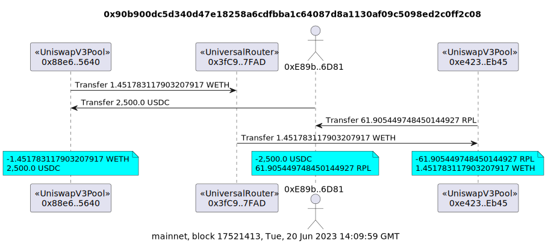

```
tx2uml value -v --mapSource 0x88e6a0c2ddd26feeb64f039a2c41296fcb3f5640,0xe42318eA3b998e8355a3Da364EB9D48eC725Eb45:0x8f8EF111B67C04Eb1641f5ff19EE54Cda062f163,0x8f8EF111B67C04Eb1641f5ff19EE54Cda062f163 0x90b900dc5d340d47e18258a6cdfbba1c64087d8a1130af09c5098ed2c0ff2c08
```

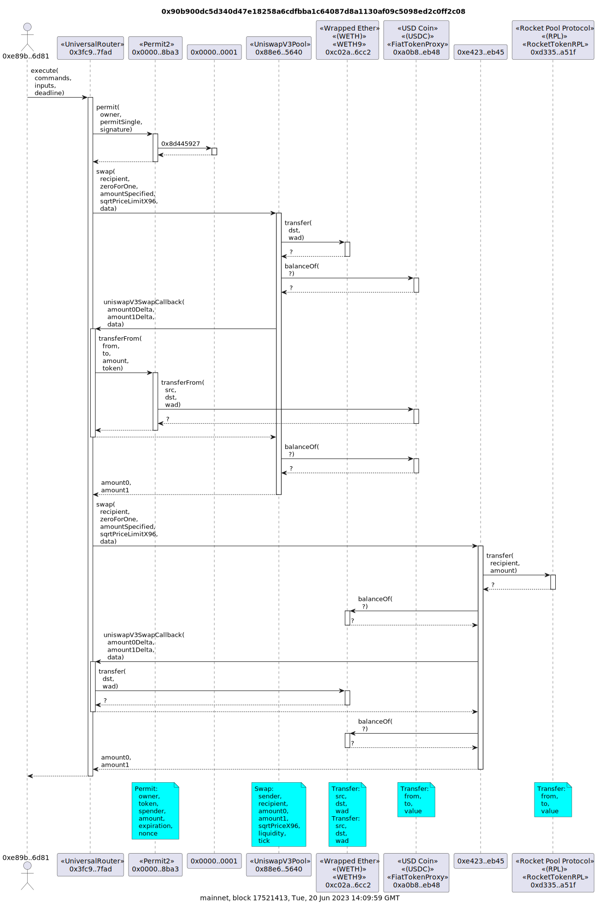

```
tx2uml -v --noTxDetails --noGas --noParamValues --noDelegates  --mapSource 0x88e6a0c2ddd26feeb64f039a2c41296fcb3f5640:0x8f8EF111B67C04Eb1641f5ff19EE54Cda062f163 0x90b900dc5d340d47e18258a6cdfbba1c64087d8a1130af09c5098ed2c0ff2c08 --outputFileName p90b92c08
```

The full call diagram with parameters and delegate calls is [90b92c08.svg](./90b92c08.svg). This was generated using the following

```
tx2uml -v --noAddresses 0x0000000000000000000000000000000000000001 --mapSource 0x88e6a0c2ddd26feeb64f039a2c41296fcb3f5640,0xe42318eA3b998e8355a3Da364EB9D48eC725Eb45:0x8f8EF111B67C04Eb1641f5ff19EE54Cda062f163,0x8f8EF111B67C04Eb1641f5ff19EE54Cda062f163 0x90b900dc5d340d47e18258a6cdfbba1c64087d8a1130af09c5098ed2c0ff2c08
```

### Add USDC and WETH liquidity

[0x57d4dadabddcf30b35199837af2614f55d09f0ae4ccf0710cbedee69324f2fa7](https://etherscan.io/tx/0x57d4dadabddcf30b35199837af2614f55d09f0ae4ccf0710cbedee69324f2fa7)

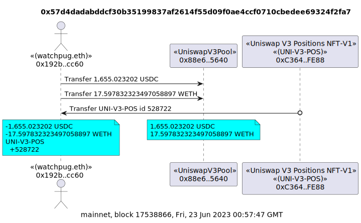

```
tx2uml value -v --mapSource 0x88e6a0c2ddd26feeb64f039a2c41296fcb3f5640:0x8f8EF111B67C04Eb1641f5ff19EE54Cda062f163 0x57d4dadabddcf30b35199837af2614f55d09f0ae4ccf0710cbedee69324f2fa7
```

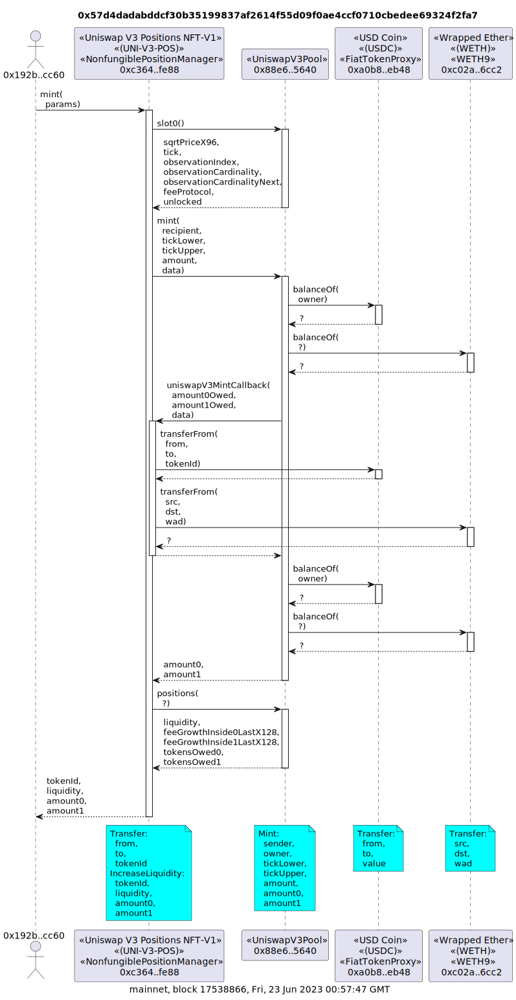

```
tx2uml -v --noTxDetails --noGas --noParamValues --noDelegates  --mapSource 0x88e6a0c2ddd26feeb64f039a2c41296fcb3f5640:0x8f8EF111B67C04Eb1641f5ff19EE54Cda062f163 0x57d4dadabddcf30b35199837af2614f55d09f0ae4ccf0710cbedee69324f2fa7 --outputFileName p57d42fa7
```

The full call diagram with parameters and delegate calls is [57d42fa7.svg](./57d42fa7.svg). This was generated using the following

```
tx2uml -v --mapSource 0x88e6a0c2ddd26feeb64f039a2c41296fcb3f5640:0x8f8EF111B67C04Eb1641f5ff19EE54Cda062f163 0x57d4dadabddcf30b35199837af2614f55d09f0ae4ccf0710cbedee69324f2fa7
```

## Wrapped Ether (WETH)

### Deposit 580 ETH for WETH

[0xab19448eb094728a7fd31e54bffc363771452fd07404314d6194a28172a4f58d](https://etherscan.io/tx/0xab19448eb094728a7fd31e54bffc363771452fd07404314d6194a28172a4f58d)

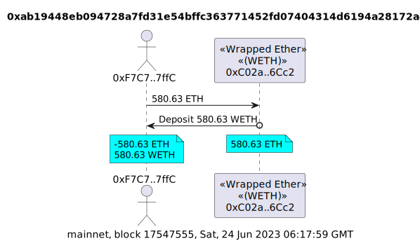

```
tx2uml value -v 0xab19448eb094728a7fd31e54bffc363771452fd07404314d6194a28172a4f58d
```

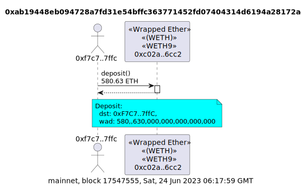

```
tx2uml -v --noTxDetails --noGas 0xab19448eb094728a7fd31e54bffc363771452fd07404314d6194a28172a4f58d
```

### Withdraw 3.2 ETH from WETH

[0xf99d2ec3d21c5925ebc1a9461ff92aa3725bd9a920d0b9531ac40925efba1303](https://etherscan.io/tx/0xf99d2ec3d21c5925ebc1a9461ff92aa3725bd9a920d0b9531ac40925efba1303)

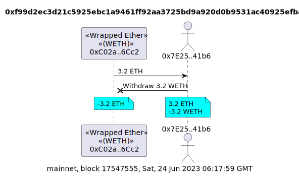

```
tx2uml value -v 0xf99d2ec3d21c5925ebc1a9461ff92aa3725bd9a920d0b9531ac40925efba1303
```

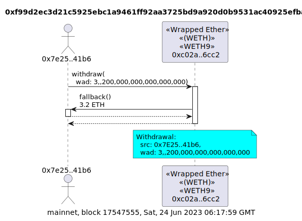

```
tx2uml -v --noTxDetails --noGas 0xf99d2ec3d21c5925ebc1a9461ff92aa3725bd9a920d0b9531ac40925efba1303
```
