# The Evolution of Uniswap

The following assumes the `ARCHIVE_NODE_URL` environment variable has been set to the URL of a provider node that supports custom EVM tracers.

## Uniswap V1

### Swap 22 USDC for ETH

[0x519acb59e0986ce142abbcec412617378499227f83e6149c2dd4aa445dda6117](https://etherscan.io/tx/0x519acb59e0986ce142abbcec412617378499227f83e6149c2dd4aa445dda6117)

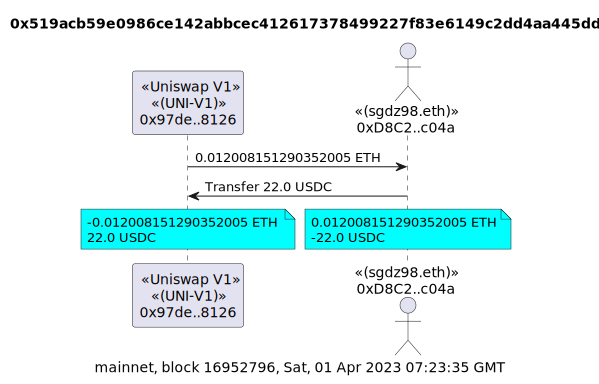

```
tx2uml value -v 0x519acb59e0986ce142abbcec412617378499227f83e6149c2dd4aa445dda6117
```

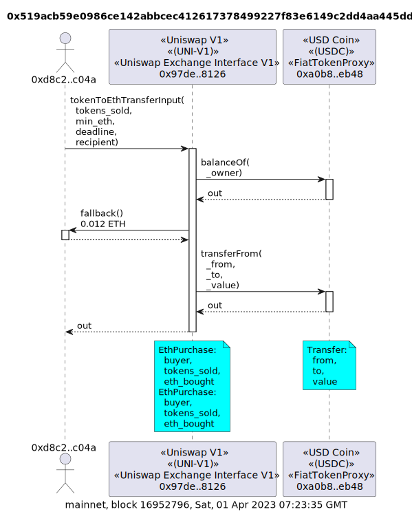

```
tx2uml -v -x 0x519acb59e0986ce142abbcec412617378499227f83e6149c2dd4aa445dda6117
```

### Swap 0.1 ETH for USDC

[0x59bd1333b443de0c3f138f5051963a9831ce3605544b27e88b2bd341d6bf7b5e](https://etherscan.io/tx/0x59bd1333b443de0c3f138f5051963a9831ce3605544b27e88b2bd341d6bf7b5e)

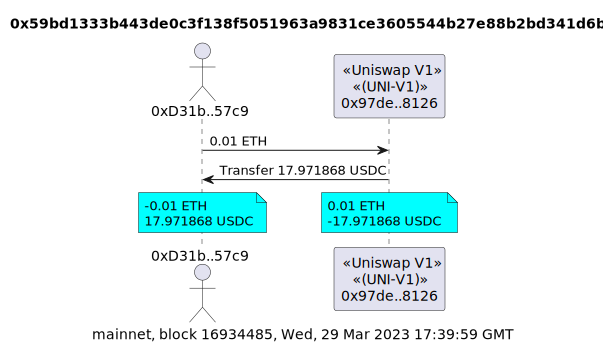

```
tx2uml value -v 0x59bd1333b443de0c3f138f5051963a9831ce3605544b27e88b2bd341d6bf7b5e
```

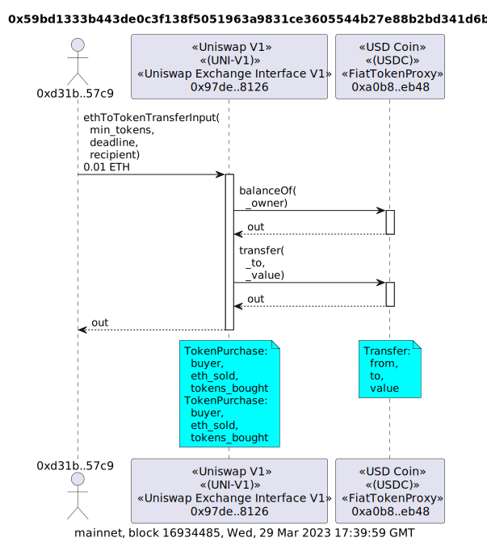

```
tx2uml -v -x 0x59bd1333b443de0c3f138f5051963a9831ce3605544b27e88b2bd341d6bf7b5e
```

### Swap 1 USDC for Matic

[0x5f99937fc8bcb99c1362d01006e6c48402c885b2e23830a8bb53242d394b2290](https://etherscan.io/tx/0x5f99937fc8bcb99c1362d01006e6c48402c885b2e23830a8bb53242d394b2290)

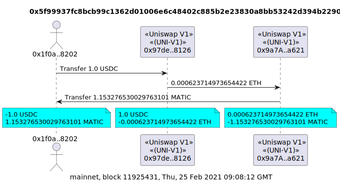

```
tx2uml value -v 0x5f99937fc8bcb99c1362d01006e6c48402c885b2e23830a8bb53242d394b2290
```

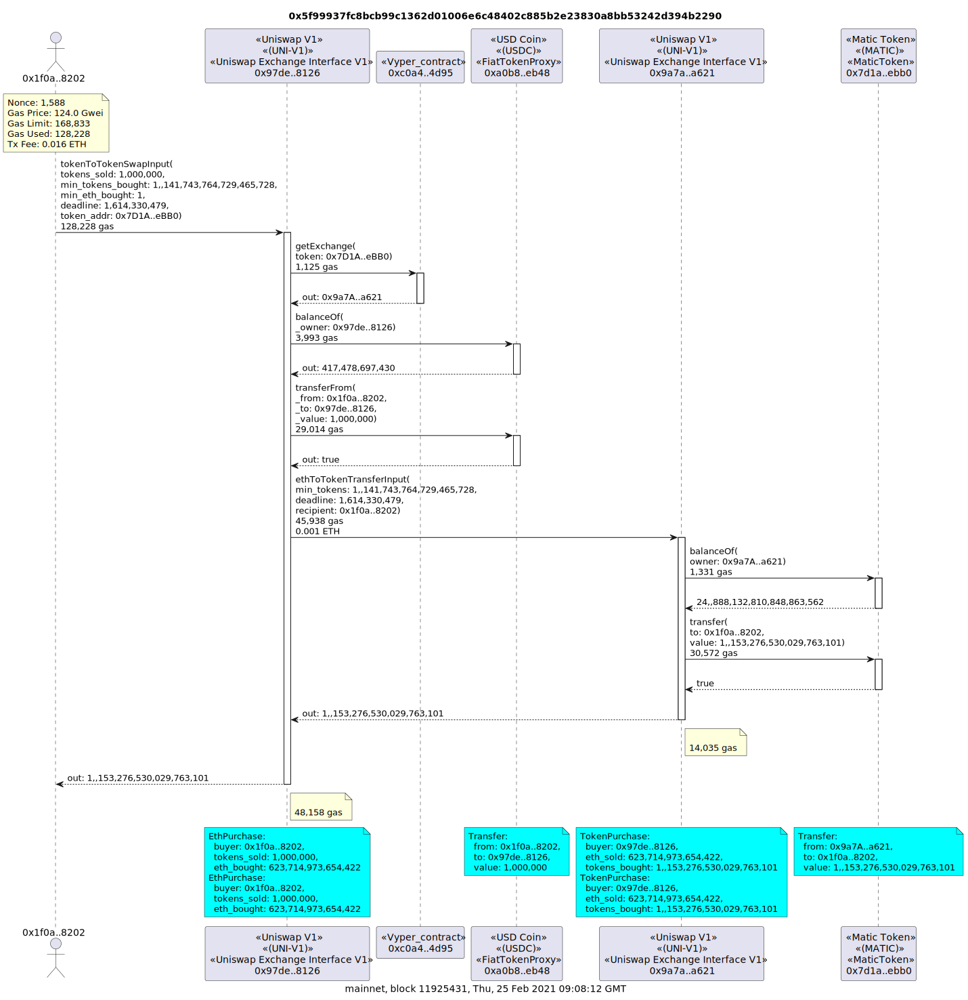

```
tx2uml -v -x 0x5f99937fc8bcb99c1362d01006e6c48402c885b2e23830a8bb53242d394b2290
```

## Uniswap V2

#### Swap 911 USDC for ETH

[0x6b3339f2576fb1eb158c58545917b7c699187d0979a814e530199b50d4a2b9e4](https://etherscan.io/tx/0x6b3339f2576fb1eb158c58545917b7c699187d0979a814e530199b50d4a2b9e4)

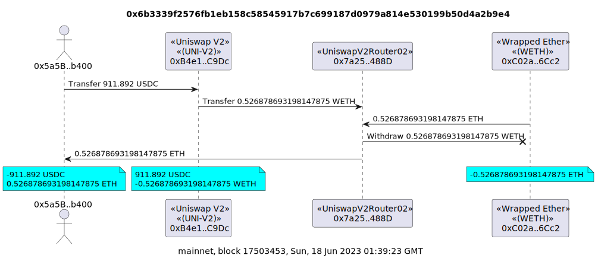

```
tx2uml value -v 0x6b3339f2576fb1eb158c58545917b7c699187d0979a814e530199b50d4a2b9e4
```

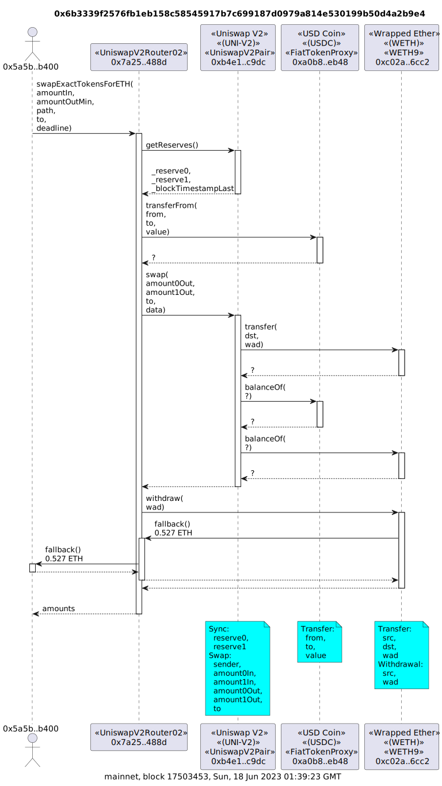

```
tx2uml -v --noDelegates 0x6b3339f2576fb1eb158c58545917b7c699187d0979a814e530199b50d4a2b9e4
```

#### Swap 57 ETH for USDC

[0x7025eeb06aab8614b02fff39f3cc10db439fbb4b525c9d2d87dbd19bf17c7cac](https://etherscan.io/tx/0x7025eeb06aab8614b02fff39f3cc10db439fbb4b525c9d2d87dbd19bf17c7cac)

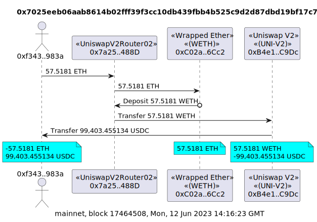

```
tx2uml value -v 0x7025eeb06aab8614b02fff39f3cc10db439fbb4b525c9d2d87dbd19bf17c7cac
```

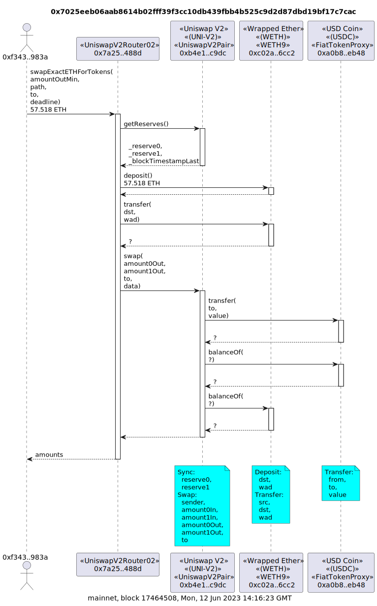

```
tx2uml -v --noDelegates 0x7025eeb06aab8614b02fff39f3cc10db439fbb4b525c9d2d87dbd19bf17c7cac
```

## Uniswap V3

### Swap 55 USDC for ETH

[0xc4eaff5ab7bacc93c76433753517c831fe0ff10182da4fc086cdf49ec7ec15b9](https://etherscan.io/tx/0xc4eaff5ab7bacc93c76433753517c831fe0ff10182da4fc086cdf49ec7ec15b9)

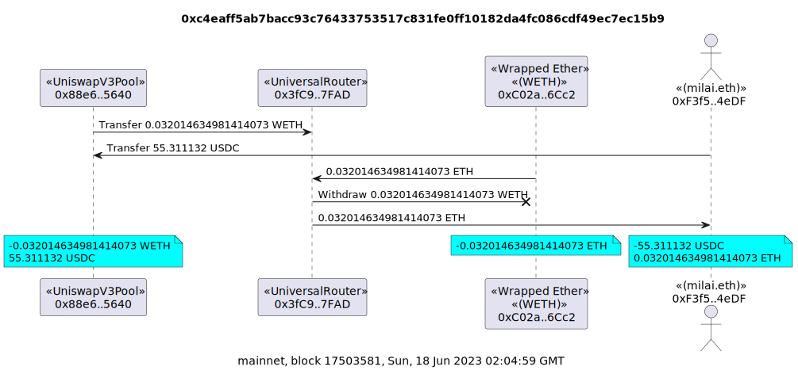

```
tx2uml value -v --mapSource 0x88e6a0c2ddd26feeb64f039a2c41296fcb3f5640:0x8f8EF111B67C04Eb1641f5ff19EE54Cda062f163 0xc4eaff5ab7bacc93c76433753517c831fe0ff10182da4fc086cdf49ec7ec15b9
```

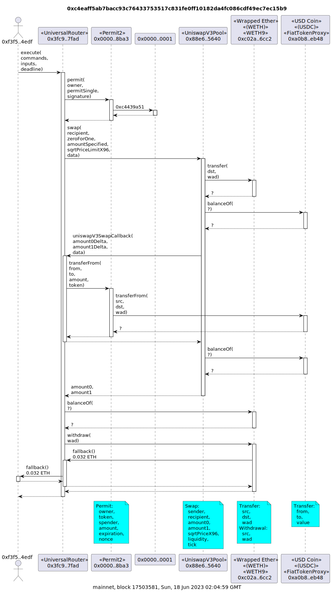

```
tx2uml -v -a 0x0000000000000000000000000000000000000001 --noDelegates --mapSource 0x88e6a0c2ddd26feeb64f039a2c41296fcb3f5640:0x8f8EF111B67C04Eb1641f5ff19EE54Cda062f163 0xc4eaff5ab7bacc93c76433753517c831fe0ff10182da4fc086cdf49ec7ec15b9
```

#### Swap 47 ETH for USDC

[0x3f019f050e79b3c7fbb5caf67fb3c842cad53e1c993f084836ae60215e3e3370](https://etherscan.io/tx/0x3f019f050e79b3c7fbb5caf67fb3c842cad53e1c993f084836ae60215e3e3370)

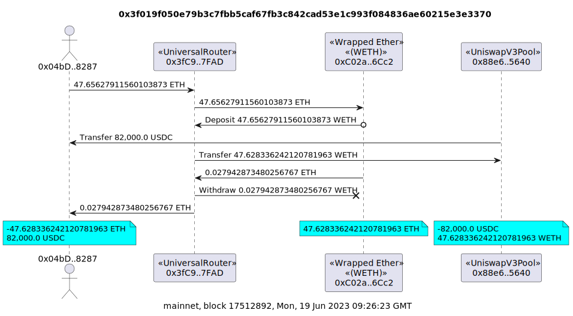

```
tx2uml value -v --mapSource 0x88e6a0c2ddd26feeb64f039a2c41296fcb3f5640:0x8f8EF111B67C04Eb1641f5ff19EE54Cda062f163 0x3f019f050e79b3c7fbb5caf67fb3c842cad53e1c993f084836ae60215e3e3370
```

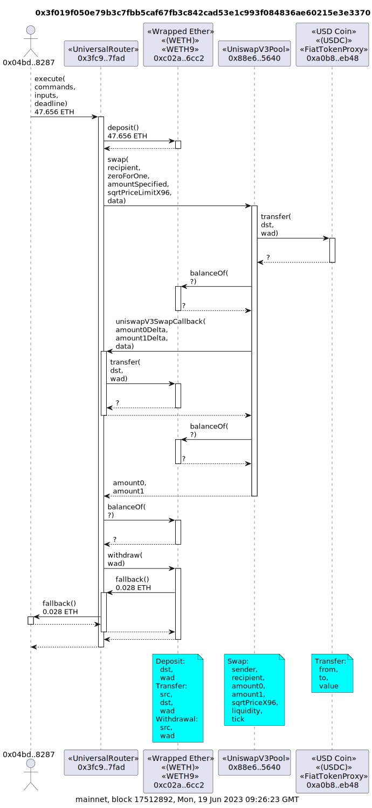

```
tx2uml -v --noDelegates --mapSource 0x88e6a0c2ddd26feeb64f039a2c41296fcb3f5640:0x8f8EF111B67C04Eb1641f5ff19EE54Cda062f163 0x3f019f050e79b3c7fbb5caf67fb3c842cad53e1c993f084836ae60215e3e3370
```
